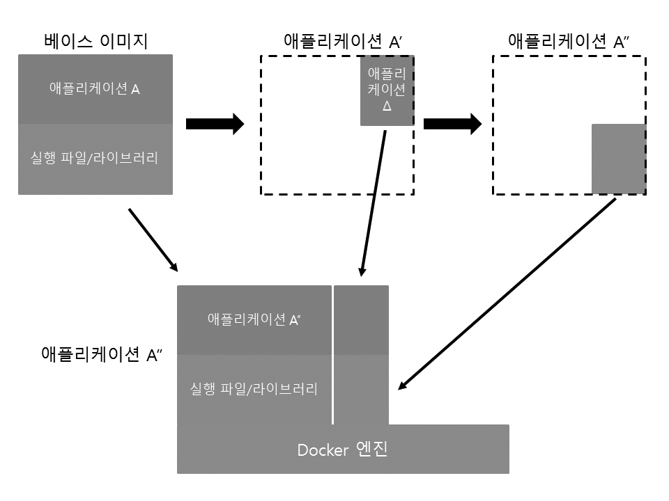

> 원본은 <http://pyrasis.com/docker.html>에 있습니다.!!
{: .prompt-tip }

# 1. 이미지(Image)

`Docker`에서 `Image`를 설명하기 전에 

베이스 이미지라는 것이 있습니다.

보통 리눅스 배포판의 유저랜드만 설치된 파일을 뜻하는데, 보통 리눅스 배포판의 이름으로 되어 있습니다.

또는 리눅스 배포판 유저랜드에 `Tomcat`,`Java`등이 설치된 베이스 이미지도 있습니다.

이렇게 `Docker Image`는 베이스 이미지에 필요한 프로그램과 라이브러리, 소스를 합친 뒤 하나의 파일로 만든 것을 의미합니다.

매 번 베이스 이미지에 필요한 프로그램과 소스를 설치하면 용량이 큰 이미지가 중복되어 설치될거라 생각할 수 있습니다. 하지만 `Docker Image`는 바뀐 부분만 이미지로 생성하고 실행할 때는 베이스 이미지와 바뀐 이미지를 합쳐서 실행하게 됩니다.

> 출처 : http://www.slideshare.net/dotCloud/why-docker

>유저랜드란 OS에서 메모리 사용을 기준으로 커널 공간과 유저 공간으로 나누는데, 유저공간에서 실행되는 파일 등을 유저랜드라고 합니다.
{: .prompt-tip}

`Docker`의 이미지는 16진수로 된 ID로 구별 됩니다.

`ubuntu:14.04`의  이미지는 511136ea3c5a,1c9383292a8f, 9942dd43ff21, d92c3c92fa73, 0ea0d582fd90, cc88e55aa5a5, c4ff7513909d로 이루어져 있습니다.

`centos:centos6` 이미지 경우 서비스 운영에 필요한 프로그램을 설치한 뒤 `Docker image`를 생성하면 `example:0.1`의 형태가 됩니다.

이렇듯 Docker는 이미지를 통째로 생성하지 않고, 바뀐 부분만 생성한 뒤 부모 이미지를 계속 참조하는 방식으로 동작합니다. 이를 `Layer`라고 합니다.

처음에 Docker Image를 저장소에서 받을때는 부모의 이미지도 함께 받습니다. 이후 수정된 내용이 있다면 수정된 내용의 이미지만 주고 받게 됩니다.

Docker의 이미지는 읽기 전용이기 때문에, 내용이 바귀면 이미지를 수정하지 않고 새로운 이미지를 생성한 뒤 내용을 기록합니다. 이를 `Union mount`라고 하고 이 서비스를 지원하는 파일시스템을 `Union File System`이라고 합니다.

# 2. 컨테이너(Container)

`Docker Container`는 이미지를 실행한 상태입니다.

이미지는 실행 파일이고, 컨테이너는 프로세스라고 이해하면 편합니다.

# 3. 정리

리눅스/유닉스 계열은 파일을 실행하기 위한 구성요소들이 잘게 쪼개져, 의존성 관계를 해결하기 어려운 부분이 있습니다.

때문에 `rpm`등 리눅스 배포판 별로 미리 컴파일된 패키지 시스템이 나왔지만 서버를 실행할 때마다 일일이 패키지를 설치, 소스 컴파일은 불편합니다.

서버 한 두대라면 어렵지 않겠지만 서버가 많아진다면 ?

때문에 서버 구성을 미리 해놓은 `Docker Image`가 필요하고, 이를 통하여 실행할 서버가 몇 개가 되든 손쉽게 해결할 수 있게 되었습니다.

