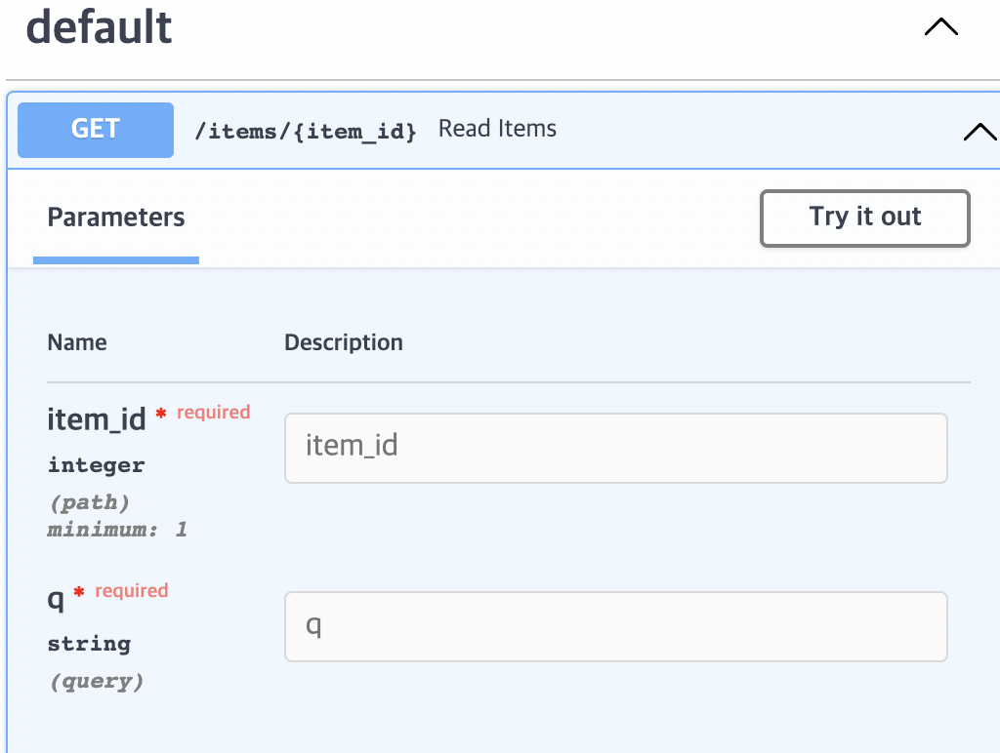

> <https://fastapi.tiangolo.com/ko/> 공식문서 따라하는 글
{: .prompt-tip }

# ☑️ 1. Path Parameters and String Validations


저번 포스팅에서는 쿼리파라미터로 요청이 들어올때를 봤고 이번 포스트에서는 `Path Parameter`, 즉 경로 매개변수로 들어올때 처리하는 방법에 대해 포스팅하게 될 것 같다.

`fastapi`에서 `Path`를 임포트 해야한다.

```text
from fastapi import FastAPI, Path, Query
```

```python
#main.py
from fastapi import FastAPI, Path, Query

app = FastAPI()

@app.get("/items/{item_id}")
async def read_items(item_id : int = Path(...,title="The ID of the item to get"),
                     q: str | None = Query(None,alias="item-query"),):
        results = {"item_id" : item_id}
        if q:
            results.update({"q" : q})
        return results
```

- `title` 메타데이터 값을 `PathParameter`의 `item_id`에 선언하였다.  
> `PathParameter`는 언제나 경로의 일부여야하므로 **필수값**이다. 때문에 `...`을 통해 필수임을 나타내는 것이 좋다. 그럼에도 `None`으로 선언하거나 기본값을 지정하더라도 아무 영향을 끼치지 않는다.
{: .prompt-tip}

-----

# ☑️ 2. Order the parameters as you need

필요한 경우에 의해 매개변수를 정렬할 수 있다.

파이썬은 default 값을 포함한 매개변수를 선언할때는 순서를 지켜줘야하는데, `FastAPI`에서는 그 순서를 고려하지 않아도 된다는 것이다.

```python
from fastapi import FastAPI, Path

app = FastAPI()


@app.get("/items/{item_id}")
async def read_items(
    q: str, item_id: int = Path(..., title="The ID of the item to get")
):
    results = {"item_id": item_id}
    if q:
        results.update({"q": q})
    return results

```

# ☑️ 3. Number validations: greater than or equal

`Query`와`Path`를 사용하여 제약조건을 걸 수가 있다.

`item_id`에 `1과 같거나 커야한다`라는 제약조건을 걸어보는 예제다.

```python
from fastapi import FastAPI, Path

app = FastAPI()


@app.get("/items/{item_id}")
async def read_items(
    *, item_id: int = Path(..., title="The ID of the item to get", ge=1), q: str
):
    results = {"item_id": item_id}
    if q:
        results.update({"q": q})
    return results

```

>OpenAPI docs에서도 확인할 수 있다.
{: .prompt-tip}




- `ge` : greater than or equal

다음은 `0보다 크고 1000보다 작거나 같다`라는 제약조건을 거는 예제다.

```python
from fastapi import FastAPI, Path

app = FastAPI()


@app.get("/items/{item_id}")
async def read_items(
    *,
    item_id: int = Path(..., title="The ID of the item to get", gt=5, le=1000),
    q: str,
):
    results = {"item_id": item_id}
    if q:
        results.update({"q": q})
    return results

```

- `gt` : greater than
- `le` : less than or equal

다음은 `Query`문을 이용하여 `float`자료형에 `10.5보다 작다`는 제약조건을 거는 예제다.

```python
from fastapi import FastAPI, Path, Query

app = FastAPI()


@app.get("/items/{item_id}")
async def read_items(
    *,
    item_id: int = Path(..., title="The ID of the item to get", ge=0, le=1000),
    q: str,
    size: float = Query(..., gt=0, lt=10.5)
):
    results = {"item_id": item_id}
    if q:
        results.update({"q": q})
    return results
```

어려운 내용은 아니니 설명은 하지 않는다.


