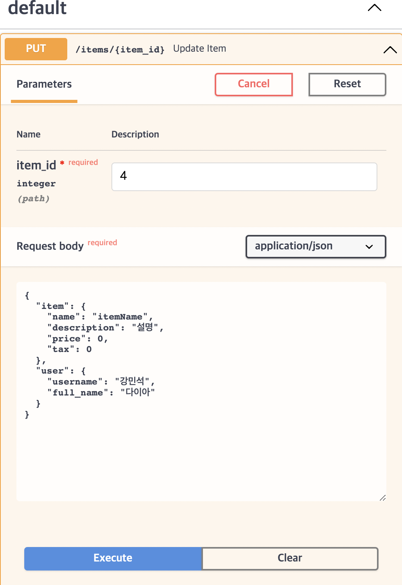

> <https://fastapi.tiangolo.com/ko/> 공식문서 따라하는 글
{: .prompt-tip }

# ☑️ 1. Body Multiple Parameters

`RequestBody`값에 `Path`와 `Query`를 적용해볼 것이다.

다음 예제는 `QueryParameter`와 `PathParameter`와 `RequestBody`를 같이 사용하는 예제다.

```python
from fastapi import FastAPI, Path
from pydantic import BaseModel

app = FastAPI()


class Item(BaseModel):
    name: str
    description: str | None = None
    price: float
    tax: float | None = None


@app.put("/items/{item_id}")
async def update_item(
    *,
    item_id: int = Path(..., title="The ID of the item to get", ge=0, le=1000),
    q: str | None = None,
    item: Item | None = None,
):
    results = {"item_id": item_id}
    if q:
        results.update({"q": q})
    if item:
        results.update({"item": item})
    return results

```

> 위의 코드에서 `item`는 `None`을 default value로 받을 수 있다는 것에 주목하자.
{: .prompt-info}

-----


# ☑️ 2. Multiple body parameters

이번에는 `RequestBody`에 여러 객체가 들어온다고 가정을 했을때 받아오는지 확인하는 예제이다.

```python
from fastapi import FastAPI, Path
from pydantic import BaseModel

app = FastAPI()

class Item(BaseModel):
    name: str
    description: str | None = None
    price: float
    tax: float | None = None

class User(BaseModel):
    username: str
    full_name: str | None = None

@app.put("/items/{item_id}")
async def update_item(item_id : int, item: Item, user:User):
    results = {"item_id" : item_id}
    if q:
        results.update({"q":q})
    if item:
        results.update({"item": item})
    return results
```

**결과**

**Input**  


**result**


- `FastAPI`는 자동으로 요청 파라미터값을 검사해서 알맞은 자료형으로 바꿔준다. 이러한 데이터의 유효성 검사를 수행하고 OpenAPI와 같이 문서화한다.

-----

# ☑️ 3. Singular values in body

- `QueryParameter`에서는 `Query`로, `PathParameter`에서는 `Path`로 제어했듯이 `RequestBody`는 `Body`로 제어한다.

```python
from fastapi import Body, FastAPI
from pydantic import BaseModel

app = FastAPI()


class Item(BaseModel):
    name: str
    description: str | None = None
    price: float
    tax: float | None = None


class User(BaseModel):
    username: str
    full_name: str | None = None


@app.put("/items/{item_id}")
async def update_item(
    item_id: int, item: Item, user: User, importance: int = Body(...)
):
    results = {"item_id": item_id, "item": item, "user": user, "importance": importance}
    return results

```

> `importance`라는 변수에 `Body(...)`라는 구문을 줘서 해당 변수가 `RequestBody`에 포함된 값임을 명시한다. 만약 사용하지 않는다면 `QueryParameter`로 인지할 것이다. 즉, 해당 구문을 사용하면 `data types`, `validate`, `document`에 대한 정보를 변환한다.
{: .prompt-info}

-----

# ☑️ 4. Multiple body params and query

추가적으로 `Query`를 명시하지 않아도 `RequestBody`와 함께 쓴다면 `singular values`는 자동으로 `QueryParameter`로 해석한다는 내용이다.


```python
from fastapi import Body, FastAPI
from pydantic import BaseModel

app = FastAPI()


class Item(BaseModel):
    name: str
    description: str | None = None
    price: float
    tax: float | None = None


class User(BaseModel):
    username: str
    full_name: str | None = None


@app.put("/items/{item_id}")
async def update_item(
    *,
    item_id: int,
    item: Item,
    user: User,
    importance: int = Body(..., gt=0),
    q: str | None = None
):
    results = {"item_id": item_id, "item": item, "user": user, "importance": importance}
    if q:
        results.update({"q": q})
    return results

```

OpenAPI(`Swagger`)에서 테스트가 가능하다.

> `Body`를 보면 `gt=0`과 같이 추가적인 `validation`이 가능하다. 
{: prompt-info}

-----

# ☑️ 5. Embed a single body parameter

만약 `RequestBody`내에 객체가 하나라면 `FastAPI`는 따로 key값을 요청하지 않는다.

예를 들면

```python
from fastapi import Body, FastAPI
from pydantic import BaseModel

app = FastAPI()


class Item(BaseModel):
    name: str
    description: str | None = None
    price: float
    tax: float | None = None


@app.put("/items/{item_id}")
async def update_item(item_id: int, item: Item = Body(...)):
    results = {"item_id": item_id, "item": item}
    return results

```

이렇게 `Item`이 하나만 들어온다하면,

`RequestBody`는 

```text
{
    "name": "Foo",
    "description": "The pretender",
    "price": 42.0,
    "tax": 3.2
}

```

이렇게 요청을 보내야하지만, 만약 내가 `key`을 명시한것을 요청으로 받고 싶다면 `embed=True`구문을 사용하면 된다.

```python
from fastapi import Body, FastAPI
from pydantic import BaseModel

app = FastAPI()


class Item(BaseModel):
    name: str
    description: str | None = None
    price: float
    tax: float | None = None


@app.put("/items/{item_id}")
async def update_item(item_id: int, item: Item = Body(..., embed=True)):
    results = {"item_id": item_id, "item": item}
    return results

```

이렇게 `embed=True`를 입력하면 

```text
{
    "item": {
        "name": "Foo",
        "description": "The pretender",
        "price": 42.0,
        "tax": 3.2
    }
}

```

이렇게 `body`를 만들어서 보내야한다. 이렇게 보내지 않으면 `error`를 발생시킨다.


-----

# ☑️ 정리

- [x] 경로에 여러 `bodyParameter`를 선언하는 방법
- [x] `singular values`를 `body`데이터로 받는 방법
- [x] `embed`를 이용하여 `key`값으로 요청 받는 방법   