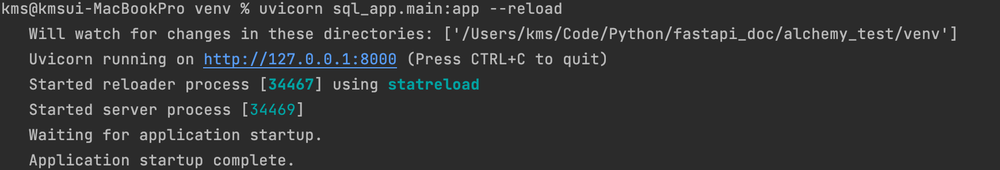
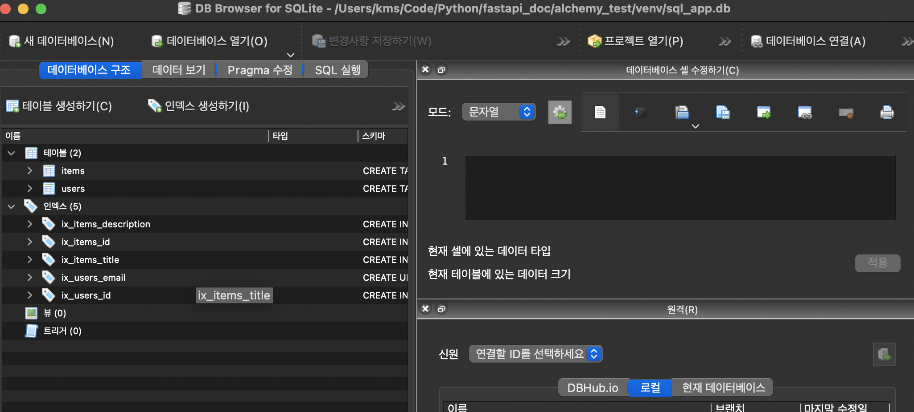

> <https://fastapi.tiangolo.com/tutorial/sql-databases/?h=sql> 공식문서 따라하는 글
{: .prompt-tip }

# ☑️ 5.1. Main FastAPI app

`sql_app/main.py`을 작성할 것이고, 작성한 다른 문서들을 통합하여 사용할 것이다.

# ☑️ 5.2. Create the database tables

database tables을 만든느건 매우매우 쉽다고 한다.

```python
from fastapi import Depends, FastAPI, HTTPException
from sqlalchemy.orm import Session

from . import crud, models, schemas
from .database import SessionLocal, engine

#만드는 부분
models.Base.metadata.create_all(bind=engine)

app = FastAPI()


```

데이터베이스를 `migration`하기 위해서는 `Alembic`이라는것을 대표적으로 사용한다.

## migration

`migration`은 `SQLAlchemy`모델에서 속성을 추가하거나 같이 구조가 바뀌거나, database의 값들을 복제하여 바꾸거나 새로운 컬럼을 넣거나 테이블을 넣거나 하는 등의 작업들을 말한다.

# ☑️ 5.3. Create a dependency

`sql_app/database.py`에서 작성한 `SessionLocal`을 불러와서 의존성을 주입할 것이다.

요청마다 독립적인 세션과 데이터베이스 커넥션을 가져야하기 때문에, 같은 세션을 통하여 모든 요청을 처리하고 요청이 처리된 후 커넥션을 닫아야 한다.

그리고 다음 요청을 위해서 새로운 세션이 생성되어야 한다.

`yield`이라는 키워드를 통해 새로운 의존성을 만들어 줄것이다. 이에 대한 설명은 <https://fastapi.tiangolo.com/tutorial/dependencies/dependencies-with-yield/>에 있다고 한다.. 나중에 저 글도 읽어볼 것이다.

우리가 만든 의존성은 `SessionLocal`을 사용하여 하나의 요청을 받고 요청이 끝나면 닫을 것이다. 

```python
from fastapi import Depends, FastAPI, HTTPException
from sqlalchemy.orm import Session

from . import crud, models, schemas
from .database import SessionLocal, engine

models.Base.metadata.create_all(bind=engine)

app = FastAPI()


# Dependency
def get_db():
    db = SessionLocal()
    try:
        yield db
    finally:
        db.close()
```

> `try`에서 `SessionLocal`을 변수에 넣고 이를 통해 요청값들을 다룰 것이다.<br>그리고 `finally`에서 해당 커넥션을 닫을 것이다. 이러한 방식을 통해 요청이 끝나면 세션은 항상 닫히게 되며, 요청에서 에러가 터져도 닫히도록 설계 했다.<br>공식문서에서는 예외처리를 해주고 싶다면 <https://fastapi.tiangolo.com/tutorial/dependencies/dependencies-with-yield/#dependencies-with-yield-and-httpexception>여기를 참고하라고 하였다.
{: .prompt-tip}

`path operation function`에 있는`dependency`를 통해 `Session`타입의 변수를 선언할 수 있다. `Session`의 기능 통해서 함수내에 동작구문들을 많이 간소화할 수 있다는데.. 한 번 보자.

```python
from fastapi import Depends, FastAPI, HTTPException
from sqlalchemy.orm import Session

from . import crud, models, schemas
from .database import SessionLocal, engine

models.Base.metadata.create_all(bind=engine)

app = FastAPI()


# Dependency
def get_db():
    db = SessionLocal()
    try:
        yield db
    finally:
        db.close()


@app.post("/users/", response_model=schemas.User)
def create_user(user: schemas.UserCreate, db: Session = Depends(get_db)):
    #추후 공개


@app.get("/users/", response_model=list[schemas.User])
def read_users(skip: int = 0, limit: int = 100, db: Session = Depends(get_db)):
    #추후 공개


@app.get("/users/{user_id}", response_model=schemas.User)
def read_user(user_id: int, db: Session = Depends(get_db)):
    #추후 공개


@app.post("/users/{user_id}/items/", response_model=schemas.Item)
def create_item_for_user(
    user_id: int, item: schemas.ItemCreate, db: Session = Depends(get_db)
):
    #추후 공개


@app.get("/items/", response_model=list[schemas.Item])
def read_items(skip: int = 0, limit: int = 100, db: Session = Depends(get_db)):
    #추후 공개

```

> 파라미터인 `db`는 `SessionLocal`타입이고 이 타입은 `sessionmaker()`를 통해 만들어졌다. 그렇기에 이는 `SQLAlchemy Session`의 `proxy`이고, 그렇기에 에디터는 어떤 함수를 제공하는 지 몰라도 된다.<br>만약 `Session`타입으로 파라미터를 넣었다면, 에디터는 `.add()`,`.query()`,`.commit()`같은 함수를 알고 있어야 한다. 
:{. prompt-info}

# ☑️ 5.4. Create your FastAPI path operations

API를 만들 것이다.

```python
from fastapi import Depends, FastAPI, HTTPException
from sqlalchemy.orm import Session

from . import crud, models, schemas
from .database import SessionLocal, engine

models.Base.metadata.create_all(bind=engine)

app = FastAPI()


# Dependency
def get_db():
    db = SessionLocal()
    try:
        yield db
    finally:
        db.close()


@app.post("/users/", response_model=schemas.User)
def create_user(user: schemas.UserCreate, db: Session = Depends(get_db)):
    db_user = crud.get_user_by_email(db, email=user.email)
    if db_user:
        raise HTTPException(status_code=400, detail="Email already registered")
    return crud.create_user(db=db, user=user)


@app.get("/users/", response_model=list[schemas.User])
def read_users(skip: int = 0, limit: int = 100, db: Session = Depends(get_db)):
    users = crud.get_users(db, skip=skip, limit=limit)
    return users


@app.get("/users/{user_id}", response_model=schemas.User)
def read_user(user_id: int, db: Session = Depends(get_db)):
    db_user = crud.get_user(db, user_id=user_id)
    if db_user is None:
        raise HTTPException(status_code=404, detail="User not found")
    return db_user


@app.post("/users/{user_id}/items/", response_model=schemas.Item)
def create_item_for_user(
    user_id: int, item: schemas.ItemCreate, db: Session = Depends(get_db)
):
    return crud.create_user_item(db=db, item=item, user_id=user_id)


@app.get("/items/", response_model=list[schemas.Item])
def read_items(skip: int = 0, limit: int = 100, db: Session = Depends(get_db)):
    items = crud.get_items(db, skip=skip, limit=limit)
    return items

```

-----

# ☑️ 6.1. About `def` vs `async def`

요청에 응답을 기다려야 한다면 다음과 같이 작성할 수 있다.

```python
user = await db.query(User).first()
#or
user = db.query(User).first()
```

이렇게 작성하면 함수 작성시 `async  def`를 쓰면 안되고 `def`로 작성해야 한다.

```python
@app.get("/users/{user_id}", response_model=schemas.User)
def read_user(user_id: int, db: Session = Depends(get_db)):
    db_user = crud.get_user(db, user_id=user_id)
    ...

```

이렇게 말이다.

> 만약 비동기로 데이터베이스와 연결하고 싶다면 <https://fastapi.tiangolo.com/advanced/async-sql-databases/>를 참고<br>`async def`와 `def`를 다루는 것에 대해 기술적으로 궁금하다면 <https://fastapi.tiangolo.com/advanced/async-sql-databases/>
{: .prompt-tip}

# ☑️ 7. Check it

이제 코드를 테스트해볼 것이다.

```bash
pip install sqlalchemy
```

`SQLAlchemy` 를 설치해주고

`sql_app`이 있는 루트 디렉토리로 가서 다음과 같이 명령어를 쳐준다.

```bash
uvicorn sql_app.main:app --reload
```



이렇게 뜨면 성공이다.

이제 

`Sqlite`가 없다면 설치를 해줘야한다.

나는 mac이므로 Homebrew로 설치하겠다.

```bash
brew install --cask db-browser-for-sqlite
```

`Sqlite`를 열고 루트 디렉터리에 저장되어 있는 `sql_app.db`을 열면

다음과 같이 뜰 것이다.



성공!!


# ☑️ 8. Alternative DB session with middleware

`yield` 키워드를 사용하지 않고 싶다면 `middleware`를 설정할 수 있다.

```python
#main.py

from fastapi import Depends, FastAPI, HTTPException, Request, Response
from sqlalchemy.orm import Session

from . import crud, models, schemas
from .database import SessionLocal, engine

models.Base.metadata.create_all(bind=engine)

app = FastAPI()


@app.middleware("http")
async def db_session_middleware(request: Request, call_next):
    response = Response("Internal server error", status_code=500)
    try:
        request.state.db = SessionLocal()
        response = await call_next(request)
    finally:
        request.state.db.close()
    return response


# Dependency
def get_db(request: Request):
    return request.state.db

...


```

`request.state`는 `Request`의 속성이다. 

데이터베이스 세션 같은 임의의 오브젝트를 request자체에 저장시키는데, 더 자세히 알아보고 싶다면 <https://www.starlette.io/requests/#other-state>

# ☑️ 9. Dependencies with `yield` or middleware

`middleware`를 사용하면 `yield`를 사용하는것과 비슷하지만 몇 가지 다르다.

- 코드량이 늘어나고, 조금 복잡해진다.
- `async`함수를 사용할 수 있다.
  - "wait"이라고 사용하면 이것은 "block"이 되면 성능이 약간 저하 될 수 있다.
  - `SQLAlchemy`을 사용하면 그다지 큰 문제가 아니라고 한다.
  - 당연하겠지만 많은 양의 `I/O waiting`이 있다면 그것은 문제가 될 것이다.
- `middleware`는 모든 요청에 대해 반응한다.
  - 그렇기에 모든 요청에 대해 커넥션을 만들게 될 것이다.
  - 심지어 요청이 `DB` 접근이 필요하지 않을지라도 커넥션을 맺는다.

> 공식문서에서는 `yield`에 대한 이해도가 있는 경우 `yield`를 사용하는것이 더 좋다고 한다. 
{: prompt-tip}

