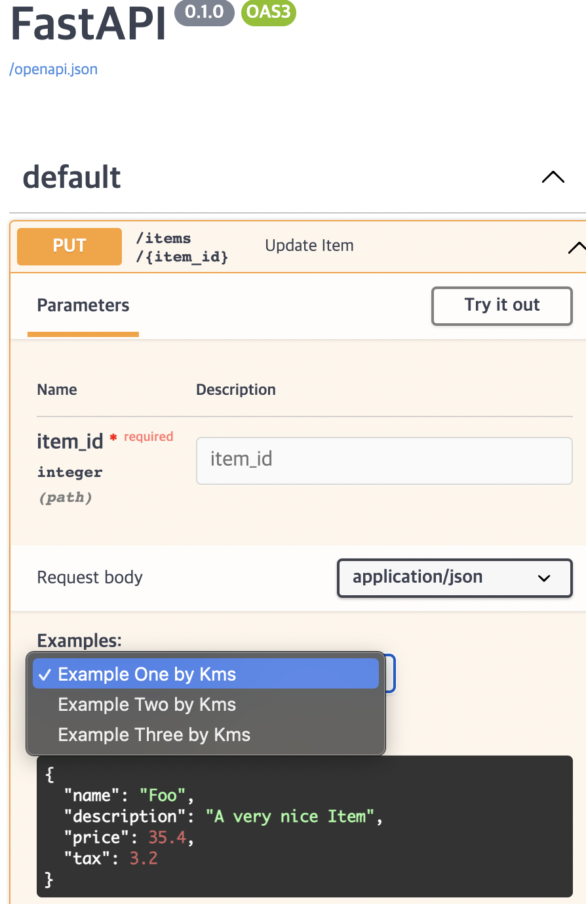

> <https://fastapi.tiangolo.com/tutorial/schema-extra-example/> 공식문서 따라하는 글
{: .prompt-tip }

# ☑️ Declare Request Example Data

임의로 데이터를 만들어서 요청을 받을 수 있다.

# ☑️ Pydantic `schema_extra`

`Pydantic`모델델의 `Config`와 `schema_extra`를 사용해서 더미데이터를 만들 수 있다.

```python
from fastapi import FastAPI
from pydantic import BaseModel

app = FastAPI()

class Item(BaseModel):
    name: str
    description: str | None = None
    price: float
    tax: float | None = None

    class Config:
        schema_extra = {
            "example": {
                "name": "kms",
                "description": "kms is handsome",
                "price": 10000.0,
                "tax": 0.2
            }
        }

@app.put("/items/{item_id}")
async def update_item(item_id: int, item: Item):
    results = {"item_id": item_id, "item": item}
    return results


```

extra는 `JSON Schema`형태의 값을 만들어내고 `Swagger`와 같은 docs에서 확인할 수 있다.


> `exmaple`이라는 것을 그대로 명시해야한다. 저 변수명(?)은 사용자가 임의로 조작하면 더미 데이터인지를 인지하지 못한다. 
{: .prompt-tip}

# ☑️ `Field` additional arguments

`Field()`를 사용하면 위에서처럼 더미데이터를 만들 수 있다.

```python
from fastapi import FastAPI
from pydantic import BaseModel,Field

app = FastAPI()

class Item(BaseModel):
    name: str = Field(example="Kms")
    description: str | None = Field(default = None, example="Kms is Handsome guy")
    price: float = Field(example=10000.5)
    tax: float | None = Field(default = None, example= 0.5)


@app.put("/items/{item_id}")
async def update_item(item_id: int, item: Item):
    results = {"item_id": item_id, "item": item}
    return results

```

> 이러한 값들은 유효성을 추가하는것이 아니고, 더미데이터라는 정보만 전달한다. 즉, 문서화의 목적으로 사용하는 것이다.
{: .prompt-warn}

# ☑️ `example` and `examples` in OpenAPI

- `Path()`
- `Query()`
- `Header()`
- `Cookie()`
- `Body()`
- `Form()`
- `File()`

을 통해서 `exmaples`이나 `example`을 선언할 수 있다고 한다.

`Body`를 사용한 `example` 코드이다.

```python
from fastapi import Body, FastAPI
from pydantic import BaseModel

app = FastAPI()


class Item(BaseModel):
    name: str
    description: str | None = None
    price: float
    tax: float | None = None


@app.put("/items/{item_id}")
async def update_item(
    item_id: int,
    item: Item = Body(
        example={
            "name": "Foo",
            "description": "A very nice Item",
            "price": 35.4,
            "tax": 3.2,
        },
    ),
):
    results = {"item_id": item_id, "item": item}
    return results

```


```text
TypeError: Body() missing 1 required positional argument: 'default'
```

에러가 뜬다.

# TypeError: Body() missing 1 required positional argument: 'default' 해결법

사실 다음 도큐문서를 보면 바로 나오는데, `Body(default = ~)`로 쓰면 바로 해결된다.

```python
from fastapi import Body, FastAPI
from pydantic import BaseModel

app = FastAPI()


class Item(BaseModel):
    name: str
    description: str | None = None
    price: float
    tax: float | None = None


@app.put("/items/{item_id}")
async def update_item(
    item_id: int,
    item: Item = Body(
        default={
            "name": "Kms",
            "description": "Handsome Guy",
            "price": 10234.2,
            "tax": 7.27,
        },
    ),
):
    results = {"item_id": item_id, "item": item}
    return results

```


즉 `example={}`를 `default={}`로 바꾸면 된다.

또는
```python
item: Item = Body(
        default={},
        example={
            "name": "Kms",
            "description": "Handsome Guy",
            "price": 10234.2,
            "tax": 7.27,
        },
    ),
```

`default={}`를 선언하고, `example`에 값을 넣으면 된다.


고로 다시 진행하겠다.

# ☑️ `Body` with multiple `examples` 

`dict`형태로 여러개의 더미데이터를 생성할 수 있다.

또한 추가적인 기능을 가지고 있는데,

- `summary` : 더미데이터의 설명
- `description` : 더미데이터의 설명이지만 길 때, `Markdown`문법도 지원한다.
- `value` : 실제로 보여줄 더미데이터 값
- `externalValue` : `value`와 달리, `URL`을 가르킨다는데.. 그리고 `value`와 달리 많은 도구들에서 지원하지는 않는다고 함.

```python
from fastapi import Body, FastAPI
from pydantic import BaseModel

app = FastAPI()


class Item(BaseModel):
    name: str
    description: str | None = None
    price: float
    tax: float | None = None


@app.put("/items/{item_id}")
async def update_item(
    *,
    item_id: int,
    item: Item = Body(
        default={},
        examples={
            "kms_Example1": {
                "summary": "Example One by Kms",
                "description": "A **normal** item works correctly.",
                "value": {
                    "name": "Foo",
                    "description": "A very nice Item",
                    "price": 35.4,
                    "tax": 3.2,
                },
            },
            "kms_Example2": {
                "summary": "Example Two by Kms",
                "description": "FastAPI can convert price `strings` to actual `numbers` automatically",
                "value": {
                    "name": "Bar",
                    "price": "35.4",
                },
            },
            "kms_Example3": {
                "summary": "Example Three by Kms",
                "value": {
                    "name": "Baz",
                    "price": "thirty five point four",
                },
            },
        },
    ),
):
    results = {"item_id": item_id, "item": item}
    return results

```

공식 문서와 예제가 좀 다른데, 마찬가지로 `body`의 첫 파라미터는 무조건 `default`를 인자로 넣어줘야한다해서 내가 임의로 바꿔보았다. 실행하면 잘 된다.




 > `description`에 `MarkDown`문법을 사용할 수 있다.
 {: .prompt-info}
