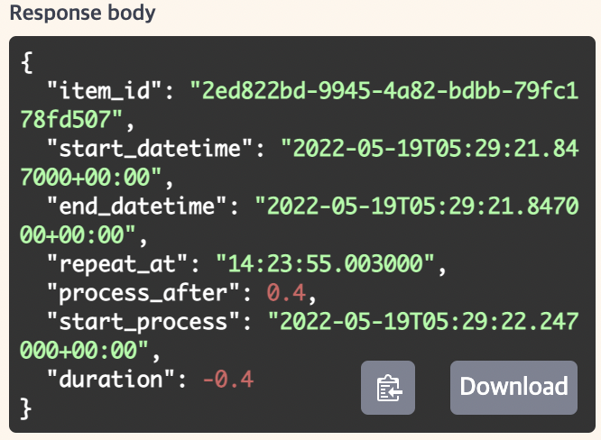

> <https://fastapi.tiangolo.com/tutorial/extra-data-types/> 공식문서 따라하는 글
{: .prompt-tip }

# ☑️ Extra Data Types

일반적인 데이터타입인 `int`,`float`,`str`,`bool`과 달리 좀 더 복잡한 데이터를 다루는 챕터이다.

좀 더 복잡한 대신에 다음과 장점들을 갖고 있다.

- 에디터가 지원한다.
- 요청으로 해당 데이터가 들어오면 데이터 변환을 한다.
- 데이터 변환을 통해 응답에 반환할 수 있다.
- 데이터 검증이 가능
- 자동 문법검사와 문서화를 갖고 있다.

# ☑️ Other data types

다음과 같은 추가 데이터타입들이 있다.

- `UUID` : 
  - 'Universally Unique Identifier"`라고 하는 것인데, 전세계적으로 고유한 값이다.
  - 요청이나 응답에 대해서 `str`로 표현이 가능하다.

- `datetime.datetime` : 
  - 날짜, 시간 표준이 `ISO 8601` 포맷으로 표현이 가능하다. 예를 들어서 `2008-09-15T15:53:00+0:00`처럼 말이다.
- `datatime.date` : 
  - 마찬가지로 `ISO 8601`표준으로 사용이 가능하다. ex) `2008-09-15`
- `datatime.time` : 
  - 마찬가지로 `ISO 8601`표준으로 사용이 가능하다. ex) `14:23:55.003`
- `datetime.timedelta` : 
  - 요청이나 응답을 보낼때에는 `float`형태의 초로 표현할 수 있다.
- `frozenset` :
  - 요청이나 응답을 보낼때 `set`처럼 사용할 수 있다.
    - 요청으로 리스트를 읽는데, 중복된 값을 제거하고 `set`으로 바꿔버린다.
    - 응답에서는 `set`이 `list`로 바뀐다.
    - 스키마를 만들때는 `set`으로 만들어진다.
- `byte` : 
  - 요청이나 응답에서는 `str`로 다뤄진다.
  - 문서화될 때에는 `binary`값으로 포맷된 `str`이 된다.
- `Decimal` : 
  - 요청이나 응답에서 `float`로 다뤄진다.

> 참고 : <https://pydantic-docs.helpmanual.io/usage/types>
{: .prompt-tip}

# ☑️ Example

```python
from datetime import datetime, time, timedelta
from uuid import UUID

from fastapi import Body, FastAPI

app = FastAPI()

@app.put("/items/{item_id}")
async def read_items(
        item_id: UUID,
        start_datetime: datetime | None = Body(default=None),
        end_datetime: datetime | None = Body(default = None),
        repeat_at: time | None = Body(default=None),
        process_after: timedelta | None = Body(default=None),
):
    start_process = start_datetime + process_after
    duration = end_datetime - start_process
    return {
        "item_id" : item_id,
        "start_datetime": start_datetime,
        "end_datetime": end_datetime,
        "repeat_at" : repeat_at,
        "process_after": process_after,
        "start_process": start_process,
        "duration": duration
    }


```

UUID가 고유한 값이라 파라미터 값으로 
```text
2ed822bd-9945-4a82-bdbb-79fc178fd507
```
를 넣고 `body`에는

```text
{
  "start_datetime": "2022-05-19T05:29:21.847Z",
  "end_datetime": "2022-05-19T05:29:21.847Z",
  "repeat_at": "14:23:55.003",
  "process_after": 0.4
}
```

이렇게 넣으면 결과값은



요로콤 나온다.

