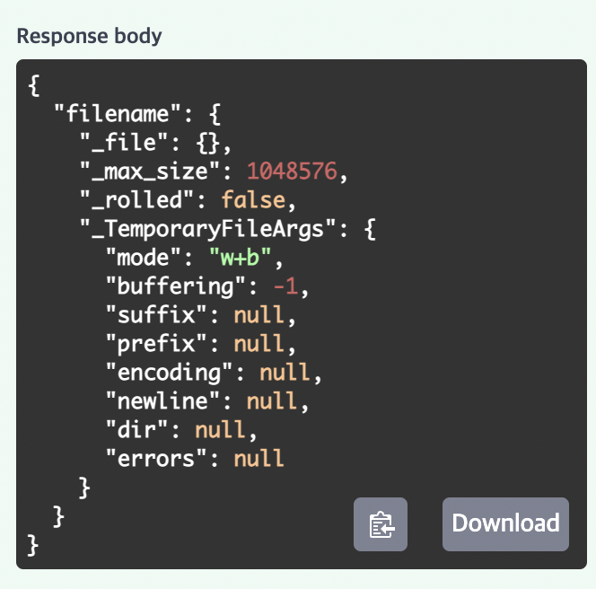
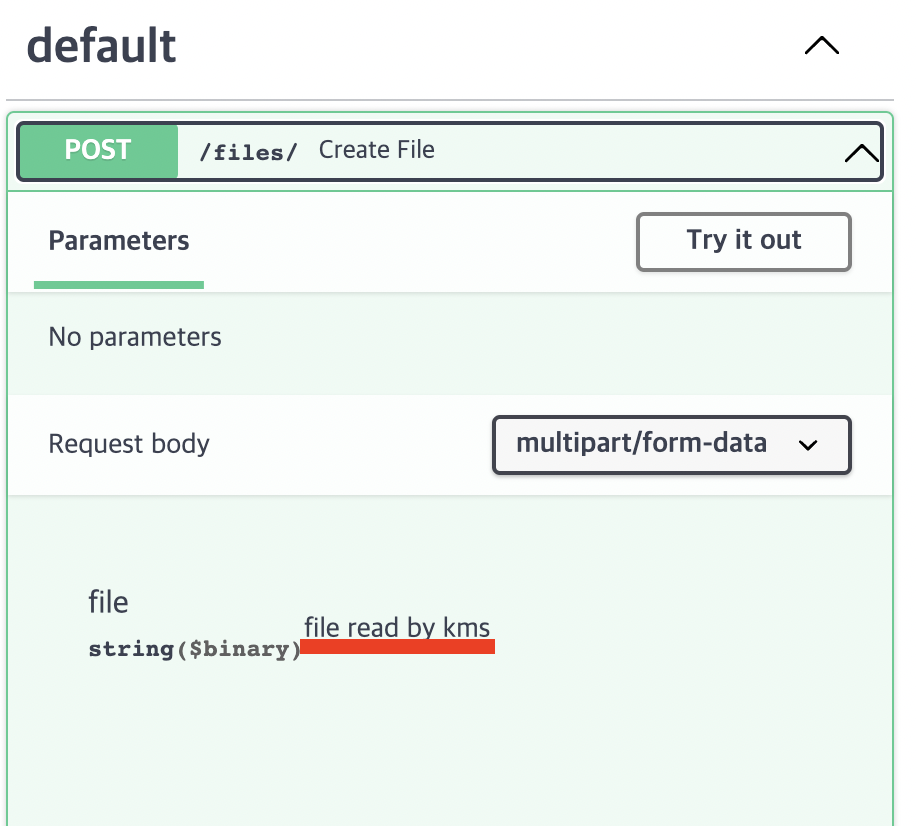
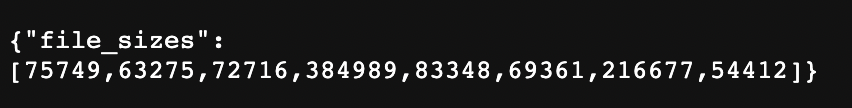
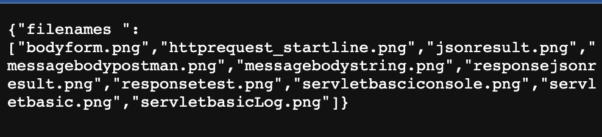

> <https://fastapi.tiangolo.com/tutorial/request-files/> 공식문서 따라하는 글
{: .prompt-tip }


# ☑️ Request Files

`File`이라는 것을 통해 파일업로드 요청을 받을 수 있다.

두 가지 방식이 있다.

> `pip install python-multipart`를 통해 필요한 모듈을 받는다.

```python
from fastapi import FastAPI, File, UploadFile

app = FastAPI()


@app.post("/files/")
async def create_file(file: bytes = File()):
    return {"file_size": len(file)}

```

- `fastapi`에서 `UploadFile, File`을 임포트 받는다.
- `file: bytes = File()`구문을 통해 파일을 받는다.
- 이렇게 명시해주지 않는다면 쿼리파라미터로 인식히거나 RequestBody로 인식할 수 있다.
- 이렇게 하면 파일은 폼데이터로 받아야한다고 한다. 
- 위의 구문처럼 `bytes`로 자료형을 명시해주면 `FastAPI`는 파일을 읽고 `bytes`형태의 파일을 서버에 전달한다. 
- 이 모든것은 메모리에 저장되므로 파일이 작을수록 더 잘 동작한다고 한다.
- 하지만 `UploadFile`을 사용하면 더 큰 혜택을 받을 수 있다.

```python
@app.post("/uploadfile/")
async def create_upload_file(file: UploadFile):
    return {"filename": file.filename}

```

이렇게 사용하면 `bytes`로 받는것보다 이점이 있다.

- `File()`구문을 작성하지 않아도 된다.
- "spooled" file이다.
  - 만약 파일의 크기가 메모리 사이즈 이상을 넘어가면 디스크에 저장한다고 한다.
- 이미지, 비디오, 큰 바이너리 파일 등과 같은 파일에 어울린다.
- 메타데이터 정보도 해당 구문을 통해 얻을 수 있다.

# ☑️ UploadFile

다음과 같은 속성을 갖는다.

- `filename` : 문자열 형태의 업로드 파일이름이다.
- `content_type` : 문자열 형태의 컨텐츠 타입을 말한다.(ex : `image/jpeg`)
- `file` : 객체 그자체를 말하는 것같다. 출력 해보면 다음과 같이 정보가 나온다.



또한, 다음과 같은 메소드를 포함하고 있다.

- `write(data)` : str,bytes 형태의 데이터를 쓴다.
- `read(size)` : size만큼의 파일을 읽는다.
- `seek(offset)` : offset만큼의 바이트위치로 이동한다. 
- `close()` : 파일을 닫는다.

이 메소드를 사용하려면 `async` 구문에서는 "await"를 사용해야한다.

`async`구문에서는 다음과 같이 작성해야하지만,
```python
contents = await.myfile.read()
```

일반적인 함수(`def`)에서는 다음과 같이 작성할 수 있다.
```python
contents = myfile.file.read()
```

# ☑️ Optional File Upload

`None`을 통해서 디폴트값을 설정할 수 있다.

```python
from fastapi import FastAPI, File, UploadFile

app = FastAPI()


@app.post("/files/")
async def create_file(file: bytes | None = File(default=None)):
    if not file:
        return {"message": "No file sent"}
    else:
        return {"file_size": len(file)}


@app.post("/uploadfile/")
async def create_upload_file(file: UploadFile | None = None):
    if not file:
        return {"message": "No upload file sent"}
    else:
        return {"filename": file.filename}

```

# ☑️ `UploadFile` with Additional Metadata

추가적인 메타데이터를 넣을 수 있다.

```python
from fastapi import FastAPI, File, UploadFile

app = FastAPI()


@app.post("/files/")
async def create_file(file: bytes = File(default=None, description="file read by kms")):
    if not file:
        return{"message" : "no file sent"}
    else:
        return {"file_size": len(file)}


@app.post("/uploadfile/")
async def create_upload_file(file: UploadFile = File(default=None,description= "upload file read by kms")):
    if not file:
        return{"message": "no upload file sent"}
    else:
        return {"filename": file.file}

```



메타데이터가 추가된 것을 확인할 수 있다.

# ☑️ Mutiple File Uploads

같은 시간에 파일을 여러개 요청 받을 수 있다.

대신 동일한 `form field`에서 `form data`를 받아야한다.

`bytes`방식, `UploadFile`방식 둘 다 받을 수 있다.

```python
from fastapi import FastAPI, File, UploadFile
from fastapi.responses import HTMLResponse

app = FastAPI()


@app.post("/files")
async def create_files(files: list[bytes] = File(default=None)):
    return {"file_sizes": [len(file) for file in files]}

@app.post("/uploadfiles/")
async def create_upload_files(files: list[UploadFile]):
    return {"filenames " : [file.filename for file in files]}

@app.get("/")
async def main():
    content = """
<body>
<form action="/files/" enctype="multipart/form-data" method="post">
<input name="files" type="file" multiple>
<input type="submit">
</form>
<form action="/uploadfiles/" enctype="multipart/form-data" method="post">
<input name="files" type="file" multiple>
<input type="submit">
</form>
</body>
    """
    return HTMLResponse(content=content)

```

<http://localhost:8000/>

에 들어가면 다음과 같이 폼 양식이 뜬다.


저기서 파일을 여러개 선택할 수 있다.

먼저 파일 사이즈를 받는 첫번째 요청에 대한 값을 확인해보았다.



다음은 여러 파일들의 이름을 반환하는 두 번째 요청를 테스트 해보았다.



# ☑️ Multiple File Uploads with Additional Metadata

파일을 여러개 받으면서 그에대한 메타정보도 추가로 작성할 수 있다.

```python
from fastapi import FastAPI, File, UploadFile
from fastapi.responses import HTMLResponse

app = FastAPI()


@app.post("/files/")
async def create_files(
    files: list[bytes] = File(description="Multiple files as bytes"),
):
    return {"file_sizes": [len(file) for file in files]}


@app.post("/uploadfiles/")
async def create_upload_files(
    files: list[UploadFile] = File(description="Multiple files as UploadFile"),
):
    return {"filenames": [file.filename for file in files]}

...

```

그냥 이런것이 있구나 하고 넘어가면 될 것 같다.

