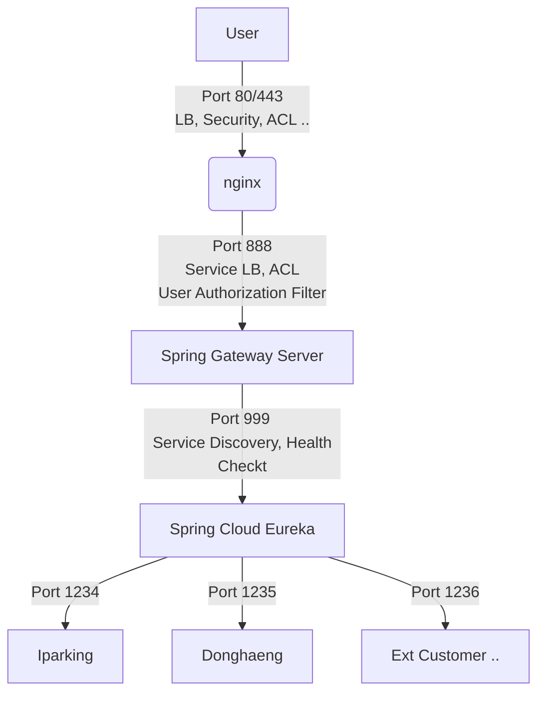

## 이유

적용을 고려하게 된 것은 기존에 관심도 있었지만

고객사가 늘어남에 따라 어쩔 수 없이 SI성 프로젝트를 띄워야하는 일이 많았다.

인증절차는 같았기에 인증 절차는 따로 뺴고 고객사별 프로젝트를 각 하나의 서비스로 보고 관리하는게 낫지 않을까해서 확장성을 고려해, 적용해보기로 했다.

즉, 최앞단에는 인증절차 서비스를 두고 거길 거치면 각 고객사의 서비스를 호출하는 형식으로 딜 것이다

걱정 되는 부분은 한 쓰레드가 여러 서비스를 왔다갔다하면서 사용자의 정보를 잘 유지하느냐의 문제인데, 일단 해보면 될 것 같다.

## 1. Eureka 서버 만들기

Eureka서버 만드는데에는 큰 어려움이 들지 않는다. 여러 블로그에 방법들이 나와있으니 참고하면 될 듯하다.

## 2. Client 등록

A고객사 서비스들을 Eureka 서버에 등록하는 작업으로 이 작업또한 크게 어렵지 않았다.
기존 프로젝트에서 `application.properties`와 build.gradle만 eureka client에 맞게 수정하면 된다.

