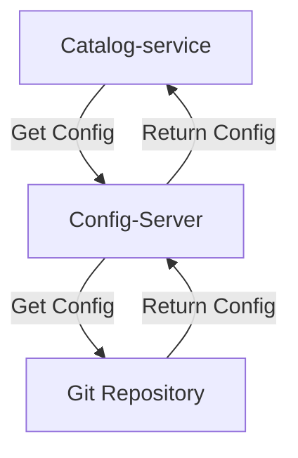

> 클라우드 네이티브 스프링 인 액션 서적의 데모 프로젝트를 모방하였습니다.
[깃 레포지토리](https://github.com/kkminseok/spring-cloud-native-example)
{: .prompt-info}


저번 포스팅에서는 간단한 컨트롤러, 서비스, 레포지토리를 만들고 테스트 및 테스트코드 작성을 하였다.

이번 챕터에서는 서버 설정관리에 대해서 학습을 하는 것 같다.

실제 운영환경에서는 외부 api의 url이 변경되거나 DB url이 변경되는 등의 상황이 생기면 해당 설정을 바꾸고 재빌드하여 서버를 다시 띄웠을 경험이 있다.

이번 챕터에서는 Spring-Config-Server를 이용하여 런타임때에도 설정정보를 갱신하여 작업할 수 있도록 도와준다.

## □ 속성 사용해보기

Spring의 프로파일을 이용하여 속성을 설정할 수도 있지만 

커맨드라인 또는 코드단에서 직접 속성을 지정하여 사용할 수 있다.

이렇게 정의된 속성들은 Spring 애플리케이션에서 직접 가져와서 사용이 가능하다.

1. Environment 추상화 사용

```java
@Autowired
private Environment environment;

public String getServerPort(){
    return environment.getProperty("server.port");
}
```


2. @Value사용

```java
@Value("${server.port}")
String port;

public String getPort() {
    return port;
}
```

1번과 2번방식 모두 단점이 있다.

결국 **하드 코딩**된 변수명을 직접 개발자가 입력해야한다.

이는 사용자의 실수로 이어질 수 있어서 `@ConfigurationProperteies` 애노테이션을 이용하여 기존 방식보다 좀 더 견고하고 유지보수하기 편하게 설정파일에 접근할 수 있다.

3. @ConfigurationProperties 사용

책에서는 해당 애노테이션을 통해서 설정정보들을 출력하는 예제를 보여준다.
물론 설정정보를 그대로 보여주는건 좋은 개발 원칙은 아니지만 예제를 위해서 쓴다고 한다.

선행으로 해야할 작업은 설정 데이터 빈을 스캔할 수 있도록 main이 있는 application 클래스의 `@ConfigurationPropertiesScan` 애노테이션을 달아줘야한다.

그리고 poperties를 지닐 클래스를 만든다.

```java
package com.polarbookshop.catalogservice.config;
import org.springframework.boot.context.properties.ConfigurationProperties;

@ConfigurationProperties(prefix = "polar")
public class PolarProperties {
    /**
     * A message to welcome users.
     */
    private String greeting;

    public String getGreeting() {
        return this.greeting;
    }

    public void setGreeting(String greeting) {
        this.greeting = greeting;
    }
}
```

`@ConfigurationProperties` 애노테이션을 달아주고, prefix구문을 사용하여 해당 키 속성을 접두사로 가지고 있는 모든 설정 정보를 가질수 있도록한다.

위의 예제처럼 javadoc을 사용하여 주석을 달아놓고, 

build.gradle에

```gradle
configurations {
	compileOnly {
		extendsFrom annotationProcessor
	}
}
dependencies { 
    ...
    annotationProcessor 'org.springframework.   boot:spring-boot-configuration-processor'
    ...
}
```

설정을 추가해주고 빌드를 진행하면


이미지처럼 자동완성 기능 및 default 설명을 추가할 수 있다.

테스트는 예제 컨트롤러를 만들어서 진행하면 된다.

```properties
polar.greeting=Welcome to the local book catalog!
```

로 설정되어있다는 가정하에


```java
@RestController
public class HelloController {

    private final PolarProperties polarProperties;

    public HelloController(PolarProperties polarProperties) {
        this.polarProperties = polarProperties;
    }

    @GetMapping("/")
    public String getGreeting() {
        System.out.println(polarProperties.getGreeting());
        return polarProperties.getGreeting();
    }
}
```

컨트롤러를 만들도 요청을 보내면

```shell
> http :9001                                                                                                                                                                                            main [331c328] modified
HTTP/1.1 200 
Connection: keep-alive
Content-Length: 34
Content-Type: text/plain;charset=UTF-8
Date: Wed, 10 Jul 2024 04:48:47 GMT
Keep-Alive: timeout=15

Welcome to the local book catalog!


```

성공적으로 설정을 가져옴을 알 수 있다.

하지만 실제 업무에 적용하려니, 문제점이 보였다.

예를들어 애플리케이션에서 사용하는 properties의 속성값이 `spring.datasource.password`와 `secret.url`, `jwt.secret`이라는 속성값들이 있을때 이를 하나의 설정 클래스 파일에 담을 수 없다.

겹치는 prefix도 없기에 각자의 설정 클래스 파일로 둬야하는데 그러면 너무 무거울뿐더러 속성값이 길면 길수록 변수명도 길어지는 문제가 있을거라는 생각을 하였다.

이처럼 설정속성이 많이 쓰이지 않고 겹치는 내용이 적다면 `@Value`를 사용하거나 `Environment`를 사용하는게 적절할 수도 있겠다.

## □ 프로파일 사용하기

### 기능 플래그로 사용

프로파일은 스프링을 배웠을때 가장 많이 사용된 기술 중 하나다.
보통 환경을 분리하기 위해 사용되는데, 그 뿐만 아니라 특정 기능을 활성화하는 용도로도 사용될 수 있다.

책에서는 `testdata`라는 프로파일이 활성화되면 테스트용 데이터를 인메모리 Repostiroy에 저장하는 로직을 추가하였다.

즉, `testdata`라는 프로파일이 활성화 되지 않으면 스프링 애플리케이션 자체는 깔끔한 상태로 될 것이고, 활성화 되지 않으면 인메모리에는 테스트용 객체를 몇 개 가진채로 서비스가 실행될 것이다.

```java
@Component
@Profile("testdata")
public class BookDataLoader {
    private final BookRepository bookRepository;

    public BookDataLoader(BookRepository bookRepository) {
        this.bookRepository = bookRepository;
    }

    @EventListener(ApplicationReadyEvent.class)
    public void loadData() {
        var book1 = new Book("1234567891", "Test", "Lyra", 9.91);
        var book2 = new Book("1234567892", "Test book", "Polar", 9.94);
        bookRepository.save(book1);
        bookRepository.save(book2);
    }
}
```

@Component로 빈을 등록해주고, @EventListener를 통해서 스프링 애플리케이션이 시작된 후 해당 메서드가 수행되게 한다.

해당 프로파일로 수행하게 하고

다음과 같이 콜하게 되면 데이터를 확인할 수 있다.

```sh
> http :9001/books                                                                                                                                                                                      main [331c328] modified
HTTP/1.1 200 
Connection: keep-alive
Content-Type: application/json
Date: Wed, 10 Jul 2024 06:55:20 GMT
Keep-Alive: timeout=15
Transfer-Encoding: chunked

[
    {
        "author": "Polar",
        "isbn": "1234567892",
        "price": 9.94,
        "title": "Test book"
    },
    {
        "author": "Lyra",
        "isbn": "1234567891",
        "price": 9.91,
        "title": "Test"
    }
]

```


### 설정 그룹으로 사용

보통 많이 사용되는 appliction-{profile}.yml 등의 파일명으로 작성하여 프로파일을 구분하는 방법이다.

책에서 커맨드 라인, JVM, 환경변수 등을 통해 애플리케이션에 설정정보를 주입하는 것을 설명한다.

이는 다른 블로그들에서도 너무 많이 다뤄져 있으므로 필자의 글에서는 생략할 것이다.


## □ Spring Cloud Config 사용하기

기존의 방식에는 문제점이 있다.

- 설정 데이터가 많아지는 등의 버전관리 및 유지관리를 하기 위해 어디에 저장할 것인가?
- 환경변수에 대한 액세스 제어는 불가능하다. 어떻게 필요에 의해서 진행해야한다면 어떻게 할 것인가?
- 버전관리는 어떻게 할 것인가?
- 서비스의 인스턴스 수가 증가하면 분산된 방식의 설정처리는 문제를 야기시킬 수 있다. 어떻게 해결할 것인가?
- 설정정보 암호화는 어떻게 할 것인가?

스프링 생태계는 이런 문제를 다룰 수 있는 방법을 가지고 있다.

3가지 분류로 나눌 수 있다는데,

- 1. 설정 서비스: 자기 자신만의 설정 서비스를 실행하고 애플리케이샨을 설정하는 데 사용할 수 있는 모듈을 제공한다.
  - 스프링 클라우드 알리바바: nacos를 데이터 자정소로 사용하는 설정 서비스 제공
  - 스프링 클라우드 컨피그: 깃 저장소, 데이터 저장소같이 장착 가능한 데이터 소스에 의해 지원되는 설정 서비스를 제공.
  - 스프링 클라우드 콘술: 하시코프 콘술을 데이터 저장소로 사용하는 설정 서비스를 제공
  - 스프링 클라우드 볼트: 하시코프 볼프를 데이터 저장소로 사용하는 설정 서비스를 제공
  - 스프링 클라우드 주키퍼: 주키퍼를 데이터 저장소로 사용하는 설정 서비스 제공

나는 회사에서 스프링 클라우드 알리바바를 사용중인데, 중국 기술이라 레퍼런스 읽기도 힘들고 설정서비스로 사용한다기보다 서비스 디스커버리로 사용하고 있다.

- 2. 클라우드 공급업체 서비스: 클라우드 공급업체가 제공하는 플랫폼에서 애플리케이션을 실행할 때 이들 업체가 제공하는 설정 서비스의 사용을 고려하는 것
  - 스프링 클라우드 aws: aws 파라미터 스코어 등과 같은 통합을 제공
  - 스프링 클라우드 애저: 애저 키 볼트와의 통합 제공
  - 스프링 클라우드 GCP: GCP 비밀관리자와 통합을 제공

- 3. 클라우드 플랫폼 서비스: 쿠버네티스 플랫폼에서 애플리케이션을 실행할 때 컨피그맵, 시크릿을 사용해 스프링 부트를 설정

책에서는 **스프링 클라우드 컨피그**를 통하여 중앙식 설정서버를 구현한다.

깃 저장소에 저장된 설정 데이터를 모든 애플리케이션에 전달해야한다는 책임이 있다.

`spring.cloud.config.fail-fast=false`같은 옵션을 따로 설정해주지 않으면 관련 설정 서버가 떠 있지 않으면 관련 서버들은 정상적으로 뜨지 않게 된다. 이 점을 유의해야한다.

### 1. git Repo 만들기

설정 서버가 설정 정보를 가져올 git Repo를 만든다. Spring-Cloud-Config는 git 레포지토리와 통합을 제공하고 있기에 

나는 https://github.com/kkminseok/spring-cloud-config-exmaple 라는 레포지토리를 만들고, `catalog-service.yml`와 `catalog-service-prod.yml`을 만들었다.

```yml
# catalog-service.yml
polar:
  greeting: "Welcome to the catalog from config server"

# catalog-service-prod.yml
polar:
  greeting: "Welcome to the production catalog from the config server + actuadtor"
```

설정 서버에서 설정 정보를 식별하기 위해서 3가지 매개변수로 식별한다.

- application: `spring.application.name`에 정의된 이름을 말한다.
- profile: 저장소에 저장된 {application}-{profile}.yml의 profile을 의미한다.
- label: label은 깃 브랜치라고 보면된다. 태그 및 커밋 해쉬코드가 될 수도 있다.

### 설정서버 흐름



이런식으로 구성이 될 것이다.

Catalog-service 애플리케이션이 뜰 때 Config-Server에 설정정보를 얻는요청을 보내고, Config-Server는 서버에 등록된 저장소에서 설정 정보를 받아온다. 

### 설정서버 의존성 설정

```gradle
implementation 'org.springframework.cloud:spring-cloud-config-server'
testImplementation 'org.springframework.boot:spring-boot-starter-test'
```

설정 서버는 `spring-cloud-config-server` 라이브러리만 있으면 된다.

이후 해당 서버의 main이 있는 클래스에 `@EnableConfigServer` 애노테이션을 달아줘서 설정서버임을 알려준다.

```java

@SpringBootApplication
@EnableConfigServer
public class ConfigServiceApplication {

    public static void main(String[] args) {
        SpringApplication.run(ConfigServiceApplication.class, args);
    }

}
```

이후 `application.yml`을 수정하여 설정서버에 대한 세부 정보를 설정해준다.

```yml
server:
  port: 8888
  tomcat:
    connection-timeout: 2s
    keep-alive-timeout: 15s
    threads:
      max: 50
      min-spare: 5

spring:
  application:
    name: config-service
  cloud:
    config:
      server:
        git:
          uri: https://github.com/kkminseok/spring-cloud-config-exmaple
          default-label: main
          timeout: 5
          clone-on-start: true
          force-pull: true

```

보통 설정서버는 8888 port를 많이 쓴다고 한다.
톰캣 설정은 개발환경 기준 앞장에서 설정한 설정 그대로 따라갔으며

config server의 설정 부를 보면 된다.

참고로 git.url이 아니고 git.uri이다.

- git.uri: 설정 정보가 있는 깃 레포지토리 주소
- default-label: 해당 레포지토리의 default로 사용할 branch 이름
- timeout: 깃 서버의 문제가 있거나 할 때 요청 timeout을 설정할 수 있다.
- clone-on-start: 서비스 시작시 저장소의 복제본을 로컬에 저장한다.
- force-pull: 로컬저장본과 원격저장소의 정보가 다른경우 무조건 pull하도록 설정한다.

이렇게 설정하고 서버의 /catalog-service/default로 요청을 보내면 git repository에 default(catalog-service.yml)에 대한 정보를 가져온다.

참고로 서버가 뜨고 설정 파일을 로컬에 저장하는 과정을 볼 수 있는데 

```sh
2024-07-11T10:29:56.049+09:00  INFO 43194 --- [config-service] [nio-8888-exec-1] o.s.c.c.s.e.NativeEnvironmentRepository  : Adding property source: Config resource 'file [/var/folders/z1/0778w9jj6yj93_cc632p_j4c0000gn/T/config-repo-1540727306232061277/catalog-service.yml]' via location 'file:/var/folders/z1/0778w9jj6yj93_cc632p_j4c0000gn/T/config-repo-1540727306232061277/'
2024-07-11T10:30:46.299+09:00  INFO 43194 --- [config-service] [nio-8888-exec-3] o.s.c.c.s.e.NativeEnvironmentRepository  : Adding property source: Config resource 'file [/var/folders/z1/0778w9jj6yj93_cc632p_j4c0000gn/T/config-repo-1540727306232061277/catalog-service-prod.yml]' via location 'file:/var/folders/z1/0778w9jj6yj93_cc632p_j4c0000gn/T/config-repo-1540727306232061277/'
2024-07-11T10:30:46.300+09:00  INFO 43194 --- [config-service] [nio-8888-exec-3] o.s.c.c.s.e.NativeEnvironmentRepository  : Adding property source: Config resource 'file [/var/folders/z1/0778w9jj6yj93_cc632p_j4c0000gn/T/config-repo-1540727306232061277/catalog-service.yml]' via location 'file:/var/folders/z1/0778w9jj6yj93_cc632p_j4c0000gn/T/config-repo-1540727306232061277/'
```

필자 기준 해당 디렉터리에 git 레포지토리 정보를 clone해온다는걸 알 수 있었다.


```sh
> http :8888/catalog-service/default                                                                                                                                                                    main [7ce04a6] modified
HTTP/1.1 200 
Connection: keep-alive
Content-Type: application/json
Date: Thu, 11 Jul 2024 01:29:56 GMT
Keep-Alive: timeout=15
Transfer-Encoding: chunked

{
    "label": null,
    "name": "catalog-service",
    "profiles": [
        "default"
    ],
    "propertySources": [
        {
            "name": "https://github.com/kkminseok/spring-cloud-config-exmaple/catalog-service.yml",
            "source": {
                "polar.greeting": "Welcome to the catalog from config server"
            }
        }
    ],
    "state": null,
    "version": "907600610dc01a4fd50ea056efb986863560d645"
}

```

catalog-service-prod.yml을 가져오고 싶다면

```sh
> http :8888/catalog-service/prod                                                                                                                                                                       main [7ce04a6] modified
HTTP/1.1 200 
Connection: keep-alive
Content-Type: application/json
Date: Thu, 11 Jul 2024 01:31:01 GMT
Keep-Alive: timeout=15
Transfer-Encoding: chunked

{
    "label": null,
    "name": "catalog-service",
    "profiles": [
        "prod"
    ],
    "propertySources": [
        {
            "name": "https://github.com/kkminseok/spring-cloud-config-exmaple/catalog-service-prod.yml",
            "source": {
                "polar.greeting": "Welcome to the production catalog from the config server + actuator"
            }
        },
        {
            "name": "https://github.com/kkminseok/spring-cloud-config-exmaple/catalog-service.yml",
            "source": {
                "polar.greeting": "Welcome to the catalog from config server"
            }
        }
    ],
    "state": null,
    "version": "907600610dc01a4fd50ea056efb986863560d645"
}
```

이렇듯 요청하면 된다.

### 설정 클라이언트 의존성 설정

이제 이 설정정보를 가져다 쓸 클라이언트에 대한 설정을 진행해야한다.

클라이언트 서비스에 대해서 build.gradle를 수정해준다.

```gradle
implementation 'org.springframework.cloud:spring-cloud-starter-config'

//내결함성 증진을 위해 실패전략 관련 라이브러리 추가 
implementation 'org.springframework.retry:spring-retry'
```

properties도 수정해준다.

```properties
# yml으로 작성할 것 그랬다.
spring.cloud.config.uri=http://localhost:8888
spring.cloud.config.request-connect-timeout=5000
spring.cloud.config.request-read-timeout=5000
spring.cloud.config.fail-fast=false
spring.cloud.config.retry.max-attempts=6
spring.cloud.config.retry.initial-interval=1000
spring.cloud.config.retry.max-interval=2000
spring.cloud.config.retry.multiplier=1.1
```

prefix인 spring.cloud.config을 제하고 나머지 설정부분에 대한 해석을 해보겠다.

- uri: 설정서버의 uri이다.
- request-connect-timeout: 설정 서버에 연결 시도할 경우 timeout
- request-read-timeout: 설정 서버에서 설정정보를 읽는것에 대한 timeout
- fail-fast: 설정 서버 연결 실패시 치명적 오류로 판단할 것인지에 대한 설정. **true인 경우에는 설정 서버에 연결 실패시 해당 서비스도 죽는다!**
- retry.max-attempts: 시도 최대 횟수
- retry.initial-interval: 최초 재시도 지연시간
- retry.max-interval: 재시도 지연 최대시간
- retry.multiplie: 지연 시간 계산 승수


이후 서비스를 띄워서 설정정보를 제대로 가져오는지 확인해본다.

저번에 작성한 Controller를 기준으로 리턴값이 뭘로 나오는지 확인하면 될 듯 하다.

```java
@GetMapping("/")
public String getGreeting() {
    System.out.println(polarProperties.getGreeting());
    return polarProperties.getGreeting();
}
```


```sh
# profile이 default인 경우
> http :9001/                                                                                                                                                                                           main [7ce04a6] modified
HTTP/1.1 200 
Connection: keep-alive
Content-Length: 41
Content-Type: text/plain;charset=UTF-8
Date: Thu, 11 Jul 2024 01:54:05 GMT
Keep-Alive: timeout=15

Welcome to the catalog from config server


# profile이 prod인 경우
> http :9001/                                                                                                                                                                                           main [7ce04a6] modified
HTTP/1.1 200 
Connection: keep-alive
Content-Length: 67
Content-Type: text/plain;charset=UTF-8
Date: Thu, 11 Jul 2024 01:54:57 GMT
Keep-Alive: timeout=15

Welcome to the production catalog from the config server + actuator
```

### 런타임 시 설정 새로고침

만약 설정정보를 깃 레포지토리에 수정 반영한 상태에서 실제 서비스중인 서버에 적용하려면 재배포를 진행해야할까? 스프링 클라우드 컨픽은 런타임시에도 설정정보를 업데이트할 수 있도록 도와준다.

책에서는 **핫 리로드**방식을 채택하여 예제로 보여주고 있다.

이 방법은 현재 서비스중인 서비스에 특수한 POST요청을 보내 설정정보를 갱신하도록 한다.

Spring-Cloud-Bus, 메시지큐 같은 솔루션을 이용하여 이 또한 자동화할 수있다.

애플리케이션 콘택스트내에서 `RefreshScopeRefreshEvent`를 발동시켜 빈들에 대한 정보를 갱신하도록 요청을 보내야한다.

이를 위해서는 `actuator`의 refresh 엔드포인트를 개방해야한다.

먼저 의존성을 추가해준다.

```gradle
implementation 'org.springframework.boot:spring-boot-starter-actuator'
```

이후 properties에서도 actuator에 대한 설정을 해준다.

```properties
#actuator
management.endpoints.web.exposure.include=refresh
```

기존 코드에서는 `@RefreshScope`가 없어도 설정들이 자동 갱신되는데, 이는 `@ConfigurationProperties`의 특별성 때문이다.

설정 파일이 변경되면, Spring Cloud Context가 Environment를 갱신하고, 이로 인해 @ConfigurationProperties가 자동으로 갱신된다.

왜냐하면 @ConfigurationProperties는 Environment를 통해 설정 값을 주입받기 때문에, Environment가 갱신되면 @ConfigurationProperties 빈도 갱신되기 때문이다.

실제로 서비스중인데 git에서 설정정보를 바꾼 뒤, 요청을 보내면

```sh
> http :9001/                                                                                                                                                                                           main [7ce04a6] modified
HTTP/1.1 200 
Connection: keep-alive
Content-Length: 67
Content-Type: text/plain;charset=UTF-8
Date: Thu, 11 Jul 2024 01:57:57 GMT
Keep-Alive: timeout=15

Welcome to the production catalog from the config server
```

바뀐 설정정보가 나온다.

