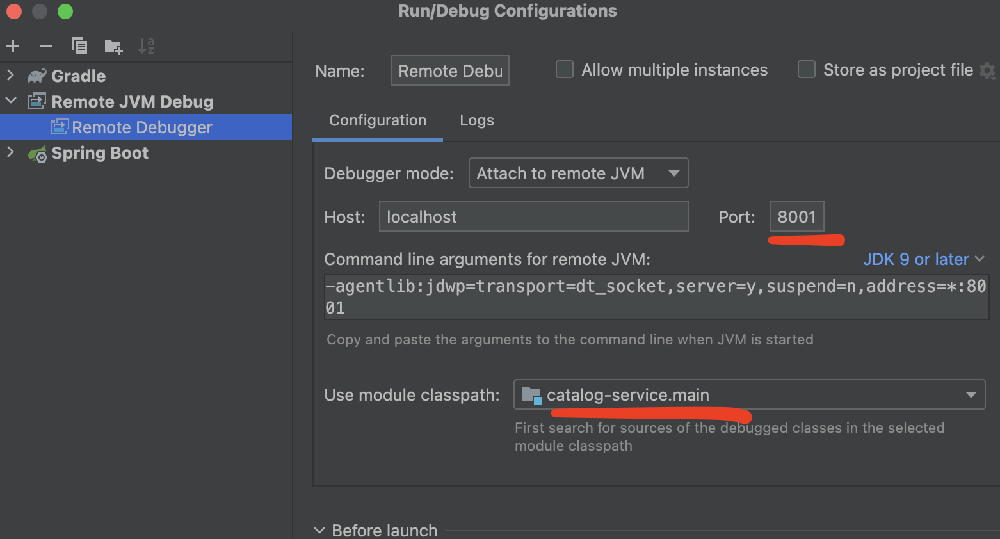

> 클라우드 네이티브 스프링 인 액션 서적의 데모 프로젝트를 모방하였습니다.
[깃 레포지토리](https://github.com/kkminseok/spring-cloud-native-example)
{: .prompt-info}

해당 장에서는 작성한 애플리케이션을 컨테이너화하여 실행하는 방법에 대해 배운다.

## □ 스프링 애플리케이션 도커 컨테이너화

도커 네트워크를 통해 postgresql 컨테이너와 Spring boot Application을 연결해야하므로 도커 네트워크를 만들어주자.

```sh
> docker network create catalog-network
fde43c98c153f3dd108e8663baca1c9a0e708d5a32531ab56491a1738576db66
```

이후, postgresql을 도커네트워크에 연결해서 다시 띄우도록 한다.

```sh
docker run -d \
  --name polar-postgres \
  --net catalog-network \
  -e POSTGRES_USER=user \
  -e POSTGRES_PASSWORD=password \
  -e POSTGRES_DB=polardb_catalog \
  -p 15432:5432 \
  postgres:latest
```

이후 스프링 프로젝트 루트 디렉터리에 터미널을 열어서 도커파일을 작성해준다.

```docker
FROM eclipse-temurin:17
WORKDIR workspace
LABEL authors="kms"

ARG JAR_FILE=build/libs/*.jar
COPY ${JAR_FILE} catalog-service.jar
ENTRYPOINT ["java", "-jar", "catalog-service.jar"]
```

jre을 미리제공하는 이미지를 베이스로 하였으며, workspace가 실제 스프링부트가 띄워지는 디렉터리가 될 것이다.

jar파일은 현재상태에서 미리 제공되어야하므로, build를 실행해준다.

```sh
 ./gradlew clean bootJar
```

이후 컨테이너 이미지를 만들어 준다.

```sh
docker build -t catalog-service .
```

버전을 지정하지 않아서 태그가 latest로 생성될 것이다.

이후 이미지를 컨테이너로 띄워준다.

```sh
docker run -d \
--name catalog-service \
--net catalog-network \
-p 9001:9001 \
-e SPRING_DATASOURCE_URL=jdbc:postgresql://polar-postgres:5432/polardb_catalog \
-e SPRING_PROFILES_ACTIVE=testdata \
catalog-service
```

네트워크를 DB와 공유해야하기에 환경변수로 데이터베이스 url을 덮어 씌워주고 testdata프로파일을 활성화하여 테스트 데이터를 넣도록 한다.

이후 9001포트에 GET요청을 보내 테스트를 해보면

```sh
> http :9001/books
HTTP/1.1 200
Connection: keep-alive
Content-Type: application/json
Date: Thu, 18 Jul 2024 12:54:21 GMT
Keep-Alive: timeout=15
Transfer-Encoding: chunked

[
    {
        "author": "Lyra",
        "createdDate": "2024-07-18T12:54:15.781522Z",
        "id": 3,
        "isbn": "1234567891",
        "lastModifiedDate": "2024-07-18T12:54:15.781522Z",
        "price": 9.91,
        "publisher": "kms",
        "title": "Test",
        "version": 1
    },
    {
        "author": "Polar",
        "createdDate": "2024-07-18T12:54:15.787297Z",
        "id": 4,
        "isbn": "1234567892",
        "lastModifiedDate": "2024-07-18T12:54:15.787297Z",
        "price": 9.94,
        "publisher": "kms",
        "title": "Test book",
        "version": 1
    }
]

```

아주 잘 호출되는걸 볼 수 있다.

하지만 매 번 도커 CLI를 통해서 컨테이너를 띄우는건 휴먼 이슈도 있을것이고 불편하다.

도커 컴포즈를 향후 사용할 것이지만 그 전에 프러덕션 환경을 위한 컨테이너 이미지 빌드라고, 스프링 부트에서 지원하는 **계층화된 JAR**을 사용해서 이미지를 보다 효율적으로 제작할 수 있는 기능이 있다.

계층화된 JAR가 등장한 이유는 간단하다.

성능이다.

현재는 빌드된 파일을 이미지 레이어에 추가하여 빌드를 진행하고 있는데, 예를 들어서 컨트롤러에서 코드 하나만 수정해도 전체 빌드를 다시해야하는 불편함이 있다.

계층화된 JAR는 도커 이미지와 비슷하게 여러 레이어로 만들어지는데, 구조는 다음과 같다.

- 의존성 계층: 프로젝트에 추가된 모든 주요 의존성
- 스프링 부트 로더: 스프링 부트 로더 컴포넌트가 사용하는 클래스
- 스냅숏 의존성 계층: 모든 스냅숏 의존성
- 애플리케이션 계층: 애플리케이션 클래스 및 리소스

이렇게 이루어져있는데, 위의 예시와 같이 컨트롤러만 수정되는 경우는 애플리케이션 계층만 작성하면 된다.

이 전략을 사용하기 위해서 일단 Dockerfile을 수정한다.

## □ 계층화된 JAR Dockerfile작성

```docker
FROM eclipse-temurin:17 AS builder
WORKDIR workspace
LABEL authors="kms"

ARG JAR_FILE=build/libs/*.jar
COPY ${JAR_FILE} catalog-service.jar
RUN java -Djarmode=layertools -jar catalog-service.jar extract

FROM eclipse-temurin:17
RUN useradd spring
USER spring
WORKDIR workspace
COPY --from=builder workspace/dependencies/ ./
COPY --from=builder workspace/spring-boot-loader/ ./
COPY --from=builder workspace/snapshot-dependencies/ ./
COPY --from=builder workspace/application/ ./

ENTRYPOINT ["java", "org.springframework.boot.loader.JarLauncher"]
```

JAR파일에서 계층을 추출하고, 각 계층을 별도의 이미지 레이어로 배치한다.  이로인해서 최종 컨테이너 이미지가 생성된다.

여기서 추가된 다른 부분은 보안에 관련된 부분인데, docker 컨테이너는 루트 사용자로 실행되기에 최소권한의 원칙에 따라 필요 이상의 권한을 갖지 않은 사용자를 만들어서 해당 사용자가 도커파일에 정의된 엔트리포인트를 실행하게끔 했다.

해당 도커파일을 기준으로 빌드를 실행해준다.

```sh
 > docker build -t catalog-service .
[+] Building 3.5s (15/15) FINISHED                                                                                                                                                         docker:desktop-linux
 => [internal] load build definition from Dockerfile                                                                                                                                                       0.0s
 => => transferring dockerfile: 624B                                                                                                                                                                       0.0s
 => [internal] load metadata for docker.io/library/eclipse-temurin:17                                                                                                                                      2.7s
 => [internal] load .dockerignore                                                                                                                                                                          0.0s
 => => transferring context: 2B                                                                                                                                                                            0.0s
 => [internal] load build context                                                                                                                                                                          0.0s
 => => transferring context: 235B                                                                                                                                                                          0.0s
 => CACHED [stage-1 1/7] FROM docker.io/library/eclipse-temurin:17@sha256:39fc8112490b67760d2dd3c8d73176f0ed323e99e7a7f09449d44fb8d1b350cc                                                                 0.0s
 => [stage-1 2/7] RUN useradd spring                                                                                                                                                                       0.2s
 => CACHED [builder 2/4] WORKDIR workspace                                                                                                                                                                 0.0s
 => CACHED [builder 3/4] COPY build/libs/*.jar catalog-service.jar                                                                                                                                         0.0s
 => [builder 4/4] RUN java -Djarmode=layertools -jar catalog-service.jar extract                                                                                                                           0.6s
 => [stage-1 3/7] WORKDIR workspace                                                                                                                                                                        0.0s
 => [stage-1 4/7] COPY --from=builder workspace/dependencies/ ./                                                                                                                                           0.1s
 => [stage-1 5/7] COPY --from=builder workspace/spring-boot-loader/ ./                                                                                                                                     0.0s
 => [stage-1 6/7] COPY --from=builder workspace/snapshot-dependencies/ ./                                                                                                                                  0.0s
 => [stage-1 7/7] COPY --from=builder workspace/application/ ./                                                                                                                                            0.0s
 => exporting to image                                                                                                                                                                                     0.1s
 => => exporting layers                                                                                                                                                                                    0.1s
 => => writing image sha256:9e4bff175df64e28ecd58accc378f1de7dc20908efb5ac2857a9afb19584976d                                                                                                               0.0s
 => => naming to docker.io/library/catalog-service                                                                                                                                                         0.0s

View build details: docker-desktop://dashboard/build/desktop-linux/desktop-linux/l5b5n2419jqzgb1cvoisx3wta

What's next:
    View a summary of image vulnerabilities and recommendations → docker scout quickview 

```

참고로 앞에서 이야기한 `grype`를 가지고 취약점 검사도 할 수 있다.

`brew install grype`로 grype를 설치하여 취약성 검사를 실행해본다.

```sh
➜  catalog-service git:(main) ✗ grype catalog-service
 ⠋ Vulnerability DB                ━━━━━━━━━━━━━━━━━━━━  [79 MB / 176 MB]  
 ✔ Loaded image                                                                                                                                                                         catalog-service:latest
 ✔ Parsed image                                                                                                                        sha256:9e4bff175df64e28ecd58accc378f1de7dc20908efb5ac2857a9afb19584976d
 ✔ Cataloged contents                                                                                                                         dbf89ba6aad1148a79f7889166105cdac426497571799ae4227742c542a72247
   ├── ✔ Packages                        [199 packages]  
   ├── ✔ File digests                    [4,599 files]  
   ├── ✔ File metadata                   [4,599 locations]  
   └── ✔ Executables                     [856 executables]  

```


## □ 클라우드 네이티브 빌드팩 사용

도커파일을 사용해서 애플리케이션을 이미지화 할 수 있지만, 빌드팩을 이용해서 이미지화 할 수도 있다.

build.gradle에 다음 구문을 추가해준다.

```gradle
bootBuildImage {
	imageName = "${project.name}" // 이미지 명
	environment = ["BP_JVM_VERSION": "17.*"] //설치할 Jvm버전
}
```

이후, 다음 명령어를 통해 애플리에키션을 이미지화 시켜준다.

```sh
> ./gradlew bootBuildImage

> Task :bootBuildImage
Building image 'docker.io/library/catalog-service:latest'

<==========---> 83% EXECUTING [1m 6s]
> :bootBuildImage

```

처음 실행하면 컨테이너 이미지를 만드는데 필요한 패키지들을 다운받느라 시간이 꽤 소요된다.

만약 본인이 M1, M2와 같은 arm64운영체제를 사용한다면

build.gradle에 다음 항목을 추가하여 arm64에서도 동작할 수 있게 수정한다.

```gradle
tasks.named('bootBuildImage') {
	if (System.getProperty("os.arch").toLowerCase().startsWith('aarch')) {
		builder = "ghcr.io/thomasvitale/builder-arm:tiny"
	}
	builder = "paketobuildpacks/builder:tiny"
}
```

이후 정상적으로 애플리케이션이 작동한 것을 확인한 뒤,

```sh
> http :9001/books                                                                                                                                                            main [15590a1] deleted renamed modified untracked
HTTP/1.1 200 
Connection: keep-alive
Content-Type: application/json
Date: Mon, 22 Jul 2024 04:35:51 GMT
Keep-Alive: timeout=15
Transfer-Encoding: chunked

[
    {
        "author": "Lyra",
        "createdDate": "2024-07-22T04:35:45.021718Z",
        "id": 1,
        "isbn": "1234567891",
        "lastModifiedDate": "2024-07-22T04:35:45.021718Z",
        "price": 9.91,
        "publisher": "kms",
        "title": "Test",
        "version": 1
    }
]
```

요청을 보내 확인하면 된다.

스프링 부트2.4부터는 이미지를 도커 허브와 같은 레지스트리로 자동 저장할 수 있게끔 지원한다.

```gradle
bootBuildImage {
	imageName = "${project.name}"
	environment = ["BP_JVM_VERSION": "17.*"]

	docker {
		publishRegistry {
			username= project.findProperty("registryUsername")
			password = project.findProperty("registryToken")
			url = project.findProperty("registryUrl")
		}
	}
}
```

docker 항목을 추가로 입력한다. 보안을 위해 설정속성들은 외부로 뺌을 알 수 있다.

이후 실행할 때에는
```sh
./gradlew bootBuildImage --imageName ghcr.io/<github_username>/catalog-service --publishImage -PregistryUrl=ghcr.io -PregistryUsername=<github_username> -PregistryToken=<github_token>
```

으로 이미지를 배포하게 되면 


이렇듯 본인 깃허브의 패키지에 배포되게 된다.

나는 추후예제 연습을위해 바로 삭제해주었다.

## □ 도커 컴포즈를 사용하여 스프링부트 앱 컨테이너화

도커 컴포즈를 사용하는 이유는 다음과 같다.
- 도커 CLI의 명령어는 방대하고 오타의 위험이 존재한다.
- 여러 도커 컨테이너를 띄우려면 더 복잡한 과정을 거친다.
- 도커 CLI는 버전관리를 하기 어렵다.

라는 이유로 도커 컴포즈를 사용하게 된다.

```yml
services:
  catalog-service:
    depends_on:
      - polar-postgres
    image: "catalog-service"
    container_name: "catalog-service"
    ports:
      - 9001:9001
    environment:
      - BPL_JVM_THREAD_COUNT=50
      - SPRING_DATASOURCE_URL=jdbc:postgresql://polar-postgres:5432/polardb_catalog
      - SPRING_PROFILES_ACTIVE=testdata
  polar-postgres:
    image: "postgres:14.12"
    container_name: "polar-postgres"
    ports:
    - 15432:5432
    environment:
    - POSTGRES_USER=user
    - POSTGRES_PASSWORD=password
    - POSTGRES_DB=polardb_catalog
```

다음과 같이 도커 컴포즈를 작성해주면 된다.

BPL_JVM_THREAD_COUNT 옵션은 JVM 쓰레드 수를 설정하는 옵션인데, 기본값은 250이다. 예제에서는 많은 값의 쓰레드를 할당할 필요가 없으므로 50으로 조정하여 애플리케이션에 너무 많은 리소스를 할당하지 않게끔 한다.

## □ 스프링 부트 컨테이너 디버깅

컨테이너로 실행하면 애플리케이션 자체가 로컬에서 실행되지 않기 떄문에 디버그하기 어려운 부분이 있다.

컨테이너 내부의 JVM에게 특정 포트를 통해 디버그 연결을 듣도롣 설정하도록 한다.
디버그 포트를  컨테이너 외부로 노출하면 IDE가 그 포트를 통해 연결을 할 수 있다.

따라서 yml파일을 업데이트해야한다.

```yml
services:
  catalog-service:
    depends_on:
      - polar-postgres
    image: "catalog-service"
    container_name: "catalog-service"
    ports:
      - 9001:9001
      - 8001:8001 # 포트 바인딩
    environment:
      - BPL_JVM_THREAD_COUNT=50
      - BPL_DEBUG_ENABLED=true # <-- 디버그 모드 활성화를 위해 JVM 설정 활성화
      - BPL_DEBUG_PORT=8001 # <-- 8001포트를 통해 디버그 연결을 받음
      - SPRING_DATASOURCE_URL=jdbc:postgresql://polar-postgres:5432/polardb_catalog
      - SPRING_PROFILES_ACTIVE=testdata
  polar-postgres:
    image: "postgres:14.12"
    container_name: "polar-postgres"
    ports:
    - 15432:5432
    environment:
    - POSTGRES_USER=user
    - POSTGRES_PASSWORD=password
    - POSTGRES_DB=polardb_catalog
```

이후 `docker-compose up -d`를 통해 컨테이너들을 실행해준다.

Intellij 기준 Remote Debugger를 연결해주면 되는데, Run/Debug Configurations 탭에 들어가서



이렇게 설정해주면 된다.

이후 컨테이너를 띄우고 디버그를 활성화하여 제대로 소켓 연결이 되었는지 확인한다.

이 모든 과정을 수동으로 진행했는데, githubAction으로 자동화하여 작업의 양을 줄이도록 해야한다.

## □ GithubAction을 이용한 배포 파이프라인 구성

3장에서 커밋단계를 위한 워크플로 작업을 진행하였다. 애플리케이션을 패키징하고 배포하는 작업을 추가해야한다.

```yml
name: Commit Stage
on: push

env:
  REGISTRY: ghcr.io # 깃허브 저장소 사용
  IMAGE_NAME: kkminseok/catalog-service # 이미지명
  VERSION: latest # 이미지 버전


jobs:
  build:
    env:
      catalog-directory: catalog-service

    name: Build and Test
    runs-on: ubuntu-22.04
    permissions:
      contents: read
      security-events: write
    steps:
      - name: Checkout source code
        uses: actions/checkout@v4
      - name: Set up JDK
        uses: actions/setup-java@v4
        with:
          distribution: temurin
          java-version: 17
          cache: gradle
      - name: Code vulnerability scanning
        uses: anchore/scan-action@v3
        id: scan
        with:
          path: "${{ github.workspace }}"
          fail-build: false
          severity-cutoff: high
          acs-report-enable: true
      - name: Upload vulnerability report
        uses: github/codeql-action/upload-sarif@v3
        if: success() || failure()
        with:
          sarif_file: ${{ steps.scan.outputs.sarif }}
      - name: Build, unit tests and integrations tests
        run: |
          chmod +x gradlew
          ./gradlew build
        working-directory: ${{env.catalog-directory}}
  package: # Job 고유 식별자
    name: Package and Publish # 이름
    if: ${{ github.ref == 'refs/heads/main' }} # main 브랜치에대해서 실행
    needs: [ build ] # build 잡이 성공적으로 수행된 경우에만 실행
    runs-on: ubuntu-22.04
    permissions:
      contents: read
      packages: write # package 쓰기 권한 추가
      security-events: write
    steps:
      - name: Checkout source code
        uses: actions/checkout@v4 
      - name: Set up JDK
        uses: actions/setup-java@v4 # Java 설치
        with:
          distribution: temurin
          java-version: 17
          cache: gradle
      - name: Build container image # 스프링 빌드 통합팩 사용
        run: | # 필자는 멀티모듈 구성이라 디렉터리로 이동해서 진행해줘야함.
          cd catalog-service 
          chmod +x gradlew
          ./gradlew bootBuildImage \
            --imageName ${{ env.REGISTRY }}/${{ env.IMAGE_NAME }}:${{ env.VERSION }}
      - name: OCI image vulnerability scanning # 취약점 검사
        uses: anchore/scan-action@v3
        id: scan
        with:
          image: ${{ env.REGISTRY }}/${{ env.IMAGE_NAME }}:${{ env.VERSION }}
          fail-build: false # 취약점이 발견되어도 빌드 실패로 만들지 않음.
          severity-cutoff: high
      - name: Upload vulnerability report # 깃허브에 보안 취약점 검사 업로드
        uses: github/codeql-action/upload-sarif@v3 
        if: success() || failure()
        with:
          sarif_file: ${{ steps.scan.outputs.sarif }}
      - name: Log into container registry # 깃허브 컨테이너 저장소 인증
        uses: docker/login-action@v3
        with:
          registry: ${{ env.REGISTRY }}
          username: ${{ github.actor }} # 현재 사용자의 깃허브 계정명
          password: ${{ secrets.GITHUB_TOKEN }} # 저장소 인증을 위한 토큰. 깃허브가 제공
      - name: Publish container image # 깃허브 레지스트리 저장소로 push
        run: docker push ${{ env.REGISTRY }}/${{ env.IMAGE_NAME }}:${{ env.VERSION }}
```

이렇게 모든 절차가 완료되면

자동으로 ghcr에 이미지가 배포되게 된다.


여기까지 6장의 내용이다.

회사에 적용해볼법한 것은 계층화된 Jar와 클라우드 빌드팩을 사용하여 이미지를 자동으로 만드는 것이고, 개인적으로 학습한 것은 Github에 Packages가 어떤 존재인지 잘 몰랐는데 이번 챕터를 통해서 학습하게 되었다.