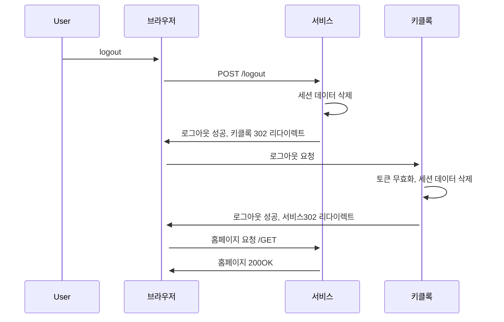

> 클라우드 네이티브 스프링 인 액션 서적의 데모 프로젝트를 모방하였습니다.
[깃 레포지토리](https://github.com/kkminseok/spring-cloud-native-example)
{: .prompt-info}


보안은 눈에 보이기에는 힘들지만 중요도가 굉장히 높은 부분이다.

나는 회사 일을 하면서 보안에 대해서 생각하기도 한다.. 초기 프로젝트 설계할때 보안에 대해 고려할 수 밖에 없으며, 여러 페이지가 연동되어있을때 보안및 인가를 어떻게 처리할지도 고민이 되는 부분이 많았다.

액세스 제어를 할 때에는 크게 3가지 단계를 따라야한다.

1. 식별: 유저명이나 이메일 같이 본인을 식별할 수 있는 것을 확인
2. 인증: 식별에서 제공한 정보를 토큰, 인증서 등을 통해 검증하는 절차
3. 인가: 인증 후에 사용자가 주어진 상황에서 무엇을 할 수 있는지 확인하는 절차


## Spring-Security 적용

앞에서 작성한 서비스 중 edge-service가 모든 요청의 진입점이므로 해당 서비스에 관련 의존성을 추가해준다


```gradle
implementation 'org.springframework.boot:spring-boot-starter-security'
```

보안과 관련된 모든 설정은 한군데서 관리하기 위해 `SecurityConfig` 클래스를 생성하여 빈을 추가한다.

```java
//웹 플럭스 제공
@EnableWebFluxSecurity
public class SecurityConfig {

    @Bean
    SecurityWebFilterChain securityFilterChain(ServerHttpSecurity http) {
        return http
                .authorizeExchange(exchange -> exchange.anyExchange().authenticated()) // 모든 요청에 대해 인증이 이뤄져야함.
                .formLogin(Customizer.withDefaults()) //시큐리티가 제공하는 로그인 방식을 통해 인증을 진행
                .build();
    }
}
```

프레임워크가 제공하는 로그인 페이지를 사용하며, 인증이 되지 않으면 해당 로그인 페이지로 자동 리다이렉션 된다.

로그인 정보중 패스워드는 서버가 시작될 때 얻은 패스워드를 넣으면 된다.

```sh
Using generated security password: 89a82550-d73d-4fd4-8ea6-91218fcf0ec0
```

username: user  
password: 89a82550-d73d-4fd4-8ea6-91218fcf0ec0

이후 localhost:9000/books로 들어가면 빈 페이지가 뜬다.
9000포트에 떠있어야할 서버가 떠있지 않지만 앞서 작성한 폴백으로 인하여 빈페이지만 뜬다.

HTTP는 상태를 갖지 않기에 쿠키게 사용자 세션을 저장하여 사용하게 된다.


이러한 방식은 클라우드 네이티브에 적용하기엔 문제점이 있는데 문제점을 분석하여 이를 해결해볼 것이다.

## 키클록을 사용하여 사용자 계정 관리

위의 방식은 사용자 인증 정보가 메모리에 올라가 있고, 이를 바탕으로 로그인을 시도하고 적용했다. 
이는 프러덕션 환경에서 사용할 수 없다.

사용자 계정을 영구히 저장할 장소와 새로운 사용자를 등록할 수 있는 방안이 필요한데, 강력한 암호화 알고리즘을 통해 암호를 저장하고 데이터베이스에 무단 엑세스 하는 것도 방지해야한다.
**키클록**은 아이디 및 엑세스 관리 솔루션이다. 단일 로그인(SSO), 소셜 로그인, 사용자 연합, 다중 요소 인증(Multi-factor authentication), 등 중앙 집중식 사용자 관리를 포함해 여러 기능을 제공한다.

OAuth2, 오픈ID 커넥트, SAML 2.0과 같은 표준을 따른다.

키클록은 지속성을 위해 관계형 데이터베이스를 필요로하며 독립적으로 부트가 가능하다.

이를 확인하기 위해 도커 컴포즈에서 키클록을 정의해본다.

```sh
services:
  polar-keycloak:
    image: quay.io/keycloak/keycloak:19.0
    container_name: "polar-keycloak"
    command: start-dev # 개발 모드로 실행(내장 데이터베이스 사용)
    environment: # 어드민 유저 정보를 환경변수로 지정
      - KEYCLOAK_ADMIN=user
      - KEYCLOAK_ADMIN_PASSWORD=password
    ports:
      - 8080:8080
```

키클록은 보안영역(Security realm)을 정의해야한다.

### 키클록 보안영역 정의

키클록은 보안에 관한 모든 사항을 영역(realm)의 맥락에서 정의하는데 기본적으로 master라는 영역으로 사전 설정되어 있지만 구축되는 애플리케이션에 대한 영역을 별도로 만드는 것이 낫기에 **PolarBookShop**이라는 영역을 만들어 보안 사항을 관장한다

```sh
# keycloak 컨테이너 진입
> docker exec -it polar-keycloak bash
```

> 실행된 것을 확인하였으면 http://localhost:8080/에서 GUI를 통해 관리도 가능하다.
{: .prompt-info}


키클록 어드민 CLI스크립트가 있는 곳으로 이동해야한다.

```sh
cd /opt/keycloak/bin/
```

어드민CLI를 사용하려면 키클록 컨테이너를 생성할 때 정의한 사용자 이름과 패스워드를 제공한다.

```sh
> ./kcadm.sh config credentials \
--server http://localhost:8080 \
--realm master \
--user user \
--password password

Logging into http://localhost:8080 as user user of realm master
```

이제 보안영역을 만들어본다.

```sh
# enabled = 생성된 realm 활성화 시킴
# -s : 속성 지정
> ./kcadm.sh create realms -s realm=PolarBookshop -s enabled=true

Created new realm with id 'PolarBookshop'
```

### 사용자 역할 관리

예제 애플리케이션의 사용자에는 2가지 유형이 있다.

- 고객: 책을 검색하고 구매할 수 있다.
- 직원: 카탈로그에 책을 추가하거나 기존 책을 삭제, 수정할 수 있다.

이 역할을 기반으로 애플리케이션 앤드포인트를 보호할 수 있는데 이를 **역할 기반 접근 제어(Role-Based Access Control)**이라고 한다.

```sh
# 역할 추가
> ./kcadm.sh create roles -r PolarBookshop -s name=employee
Created new role with id 'employee'
> ./kcadm.sh create roles -r PolarBookshop -s name=customer
Created new role with id 'customer'
```

이후 2명의 사용자를 만든다. **minseok Kang**은 서점의 직원이자 고객이다.

```sh
> ./kcadm.sh create users -r PolarBookshop \
-s username=minseok \
-s firstName=Minseok \
-s lastName=Kang \
-s enabled=true

Created new user with id '350d6ad7-bc75-41e6-a29a-50b0a81efb74'

> ./kcadm.sh add-roles -r PolarBookshop --uusername minseok --rolename employee --rolename customer
```

똑같은 방식으로 고객의 역할을 가진 **Bjorn Vinterberg**라는 이름을 가진 유저를 만든다.

```sh
> ./kcadm.sh create users -r PolarBookshop \
-s username=bjorn \
-s firstName=Bjorn \
-s lastName=Vinterberg \
-s enabled=true

Created new user with id '9dff5d03-4870-4606-9862-dac5fef2ee26'

> ./kcadm.sh add-roles -r PolarBookshop --uusername bjorn --rolename customer
```

실제 환경에서는 패스워드는 사용자가 선택하고 2단계 인증을 하겠지만 위 둘은 테스트 사용자이므로 임의로 패스워드를 지정해준다.

```sh
> ./kcadm.sh set-password -r PolarBookshop \
--username minseok --new-password password

> ./kcadm.sh set-password -r PolarBookshop \
--username bjorn --new-password password
```

테스트 사용자를 만들었고 애플리케이션 레벨에서 인증전략을 어떻게 사용할 수 있을지 고민해야한다.

## 오픈ID 커넥트, JWT 및 키클록을 통한 인증

현재 키클록 브라우저에서 로그인을 통해 인증을 수행하게 되는데, 애플리케이션 레벨에서 인증은 키클록에 위임하고 신원 확인만을 위한 프로토콜을 수립, 데이터 형식을 정의해야한다. 이를 정의하기 위해서는 오픈ID 커넥트, JSON 웹토큰을 통해서 진행한다.

- 오픈ID커넥트: 인증서버에게 인증을 맡기고 그 결과를 기반으로 **사용자의 신원을 확인하고 사용자의 정보를 검색할 수 있게 하는 프로토콜**이다. 인증 서버는 인증 단계의 결과를 ID토큰을 통해 클라이언트 애플리케이션에 전달한다. 
    - OAuth2는 인증 토큰을 통해 액세스 위임 문제를 해결하지만 인증 자체를 다루지는 않음. 
즉, Oauth2 + 인증 = OpenID Connect라고 이해하면 된다.
    - ID토큰이란 사용자 인증 이벤트에 대한 정보를 나타내는 JSON웹 토큰같은것들을 말한다.

OAuth2 프레임워크는 3가지 주요 행위가 있다.

1. 인증 서버: 사용자 인증 및 토큰 발행을 담당하는 개체. ex) keycloak
2. 사용자: 클라이언트 애플리케이션에 대한 인증된 액세스를 얻기 위해 인증 서버에 로그인 하는 사람들. ex) 고객
3. 클라이언트: 사용자를 인증해야하는 애플리케이션 

여담으로 키클록의 장점으로는 사용자가 로그인하기 위해 키클록과 직접 상호작용하기에 키클록 외에 어떤 시스템의 구성요소도 사용자의 정보가 노출되지 않는다는 장점이 있다.


전체적인 흐름은 다음과 같다.

1. 사용자가 애플리케이션에 요청
2. 애플리케이션이 키클록으로 302 리다이렉트(로그인 필요)
3. 사용자가 로그인 진행(요청은 애플리케이션으로)
4. 애플리케이션에서 키클록으로 요청 전달
5. 키클록이 크리덴셜 확인 후 인증코드 반환 + 애플리케이션으로 리다이렉트
6. 애플리케이션이 받은 인증코드로 키클록에 ID Token(JWT) 교환 요청
7. 키클록이 JWT반환
8. 애플리케이션이 해당 정보를 가지고 JWT파싱 및 세션 저장
9. 사용자 요청때마다 해당 정보를 사용

으로 진행된다.

이 흐름을 따라가기 위해 먼저 키클록에서 애플리케이션을 등록해본다.

### 키를록, 애플리케이션 연동

먼저 키클록 컨테이너 들어가서 세션 로그인을 진행해준다.

```sh
bash-4.4$ cd /opt/keycloak/bin/
bash-4.4$ ./kcadm.sh config credentials --server http://localhost:8080 \
> --realm master --user user --password password
```

이후 애플리케이션에 대한 클라이언트를 생성해준다.

```sh
bash-4.4$ ./kcadm.sh create clients -r PolarBookshop \ #realm
> -s clientId=edge-service \ 
> -s enabled=true \
> -s publicClient=false \ # 기밀 클라이언트
> -s secret=polar-keycloak-secret \ # 기밀클라이언트이므로 인증을 위한 시크릿 지정
> -s 'redirectUris=["http://localhost:9000","http://localhost:9000/login/oauth2/code/*"]' # 사용자 로그인, 로그아웃 후 요청을 리다이렉션할 수 있는 권한을 키클록에 부여한 애플리케이션 URL
Created new client with id 'f0e23430-3acc-4e3a-9b19-62650d011166'
```

참고로 localhost:9000/login/oauth2/code/*는 스프링 시큐리트가 기본적으로 제공하는 기본 형식이다. 로그아웃 후  리다이렉션을 지원하라면 localhost:9000도 추가해야한다.

이제 OIDC 프로토콜을 이용해서 사용자 인증을 키클록에 위임하도록 애플리케이션을 리팩터링 해야한다.

목적은 3가지다

1. 오픈ID 커넥트를 사용한 사용자 인증
2. 사용자 로그아웃 설정
3. 인증된 사용자 정보 추출

## 오픈ID 커넥트, JWT 등에 대한 애플리케이션 리팩터링


먼저 Oauth2/OIDC클라이언트 기능을 지원하는 의존성을 추가한다.

### 의존성 및 설정 수정

```gradle
implementation 'org.springframework.boot:spring-boot-starter-oauth2-client'
// test용
testImplementation 'org.springframework.security:spring-security-test'
```

스프링 시큐리티와 키클록 통합 설정을 위해서 프로젝트의 `application.yml`파일을 열어서 정보를 수정해준다. 

위에서 키클록 admin-cli에서 클라이언트를 생성할 때 식별자(edge-service)와 공유 시크릿(polar-keycloak-secret)을 정의하였다. 이를 이용해서 매핑해줘야한다.

```yml
spring:
  security:
    oauth2:
      client:
        registration:
          # 밑의 식별자 이름은 아무거나 괜ㅊ낳다.
          keycloak:
            # 키클록에 정의된 클라이언트 식별자 
            client-id: edge-service
            # 키클록에 정의된 공유 시크릿
            client-secret: polar-keycloak-secret
            # 접근권한을 갖기를 원하는 영역의 목록. openid영역은 OAuth2에서 OIDC인증 수행
            scope: openid
        provider:
          # 위의 registration에 정의된 이름과 같으면 됨.
          keycloak:
            # 특정 영역에 대한 OAuth2와 OIDC관련 모든 엔드포인트의 정보를 제공하는 키클록 URL
            issuer-uri: http://localhost:8080/realms/PolarBookshop
```

### 스프링 시큐리티 수정

기존 코드는 요청한 모든 사용자에 대해서 인증절차를 진행하도록 되어있는데 이를 바꿔서 **OIDC인증**을 사용하도록 바꿔본다.

```java
package com.polarbookshop.edgeservice.config;

import org.springframework.context.annotation.Bean;
import org.springframework.security.config.Customizer;
import org.springframework.security.config.annotation.web.reactive.EnableWebFluxSecurity;
import org.springframework.security.config.web.server.ServerHttpSecurity;
import org.springframework.security.web.server.SecurityWebFilterChain;

@EnableWebFluxSecurity
public class SecurityConfig {

    @Bean
    SecurityWebFilterChain securityFilterChain(ServerHttpSecurity http) {
        return http
                .authorizeExchange(exchange -> exchange.anyExchange().authenticated()) // 모든 요청에 대해 인증이 이뤄져야함.
                .oauth2Login(Customizer.withDefaults()) //Oauth2/오픈ID커넥트 방식을 이용한 로그인 인증 진행
                .build();
    }
}
```

이후 localhost:9000에 접속하면 keycloak 페이지로 자동 리다이렉트 될 것이다.


> 이후 위에서 정의한 minseok, password 계정정보로 로그인하면 되어야하는데.. 사용자 정보를 도중에 가이드대로 바꿔주어서 isabelle 이라는 이름으로 로그인해야한다. 패스워드는 같다.
{: .prompt-warn}


로그인을 진행하고 성공하면 localhost:9000으로 리다이렉션되는데 아무런 설정도 해주지 않았기에 빈 화면만 보이게 된다.

인증 자체는 성공하였으니, 스프링 시큐리티와 인증성공한 세션에 대하여 브라우저와 통신하고 저장하게 된다.

이를 구현해보도록 한다.

## 스프링 시큐리티 컨텍스트에 인증정보 저장

사용자에 대한 정보를 매핑하기 위한 스프링 시큐리티가 제공하는 컨텍스트를 정의하고 절차를 진행해보도록 한다.

먼저 사용자에 대한 정보를 저장할 모델이 필요하므로 레코드를 하나 작성한다.

```java
package com.polarbookshop.edgeservice.user;

import java.util.List;

public record User(
        String username,
        String firstName,
        String lastName,
        List<String> roles
) { }
```

스프링 시큐리티는 인증된 사용자(Principal)에 대한 정보를 Authentication을 구현한 객체의 한 필드에 넣게 되어있다

그래서 로그인한 사용자의 인증 객체에 엑세스하는 한 가지 방법은 ReactiveSecurityContextHolder 또는 SecurityContextHolder로부터 검색해서 가져온 SecurityContext에서 해당 객체를 추출하는 것이다.

객체를 추출하기 위해서 시큐리티 콘텍스트 구조를 알아야하는데 위의 경우 대략 이렇게 감싸져있다.

```text
SecurityContext -> Authentication -> OidcUser(Principal) -> OidcIdToken
```

즉, OidcUser 인터페이스의 유형에 ID토큰값을 저장하며, 이 값은 Authenication에 저장되고 SecurityContext가 이를 관리하는 구조이다.

그렇기에 새로운 유저를 관리할 때도 위 구조에 따라 유저를 추가할 수 있다.

유저를 넣을 엔드포인트와 메서드를 구현해보자.

```java
package com.polarbookshop.edgeservice.user;

import org.springframework.security.core.context.ReactiveSecurityContextHolder;
import org.springframework.security.core.context.SecurityContext;
import org.springframework.security.oauth2.core.oidc.user.OidcUser;
import org.springframework.web.bind.annotation.GetMapping;
import org.springframework.web.bind.annotation.RestController;
import reactor.core.publisher.Mono;

import java.util.List;

@RestController
public class UserController {
    
    @GetMapping("user")
    public Mono<User> getUser() {
        return ReactiveSecurityContextHolder.getContext()
                .map(SecurityContext::getAuthentication)
                .map(authentication ->
                        (OidcUser) authentication.getPrincipal())
                .map(oidcUser -> 
                        new User(
                                oidcUser.getPreferredUsername(),
                                oidcUser.getGivenName(),
                                oidcUser.getFamilyName(),
                                List.of("employee", "customer")
                        )
                );
    }
}
```

이런 일련의 과정을 스프링 웹MVC와 웹플럭스에서 제공하는 애플리케이션을 통해 줄일 수 있다.

```java
@GetMapping("user")
public Mono<User> getUser(@AuthenticationPrincipal OidcUser oidcUser) {
        var user = new User(
                oidcUser.getPreferredUsername(), 
                oidcUser.getGivenName(),
                oidcUser.getFamilyName(),
                List.of("employee", "customer")
        );
        return Mono.just(user);
}
```

이후 서버를 띄우고 localhost:9000/user에 접근하여 로그인을 수행하면

```json
{
  "username": "bjorn",
  "firstName": "Bjorn",
  "lastName": "Vinterberg",
  "roles": [
    "employee",
    "customer"
  ]
}
```

라고 정상 출력된다.

유저가 가지고 있는 권한에 따라 **사용률 제한**을 할 수있는데 간단한 예제를 통해서 제한해보겠다.

`RateLimiterConfig`클래스에서 인증된 Principle 사용자 이름을 추출하는데 만약 인증되지 않은 사용자라면 사용률 제한을 걸도록한다.

```java
@Configuration
public class RateLimiterConfig {

    @Bean
    public KeyResolver keyResolver() {
        return exchange -> exchange.getPrincipal()
                .map(Principal::getName)
                .defaultIfEmpty("anonymous");
    }
}
```

이 코드가 사용률 제한이 되는이유는 KeyResolver가 요청을 구분할 때 키 값을 사용하는데, 이를 인증된 사용자라면 사용자의 이름으로 키값을 사용하지만 인증되지 않은 사용자라면 **anonoymous**라는 키를 공유하기 때문에 제한이 된다. 추가로 인증되지 않은 사용자에게 IP별로 제한을 둘 수 있고 고유한 랜덤값을 생성하여 제한을 받게 할 수도 있다.


## 스프링 시큐리티 및 키클록 로그아웃 적용

스프링 시큐리티에서 사용자가 로그아웃을 하게 되면 모든 세션 데이터를 삭제하게 된다. OpenID 커넥트/Oauth2를 사용하면 사용자를 위해 스프링 시큐리티가 저장한 토큰 역시 삭제된다. 그러나 키클록에는 해당 사용자에 대한 세션을 가지고 있기에 완전히 로그아웃을 하려면 스프링 시큐리티, 키클록이 저장하고 있는 값들을 삭제해줘야한다.

스프링 시큐리티가 지원하고 있는 것들 중에 스프링시큐리티단에서 로그아웃을하면 키클록에도 전파하여 로그아웃 시키는 기술이 있다.

플로우를 정의하면 다음과 같다.



키클록에 전파하기 위해서 스프링 시큐리티에서 제공하는 `OidcClientInitatedServerLogoutSuccessHandler`같은 객체들을 이용해야한다.
`SecurityConfig` 클래스에서 로그아웃 관련 메서드들과 객체들을 정의하여 사용해보자.

```java
    @Bean
    SecurityWebFilterChain securityFilterChain(ServerHttpSecurity http, ReactiveClientRegistrationRepository clientRegistrationRepository) {
        return http
                .authorizeExchange(exchange -> exchange.anyExchange().authenticated()) // 모든 요청에 대해 인증이 이뤄져야함.
                .oauth2Login(Customizer.withDefaults()) //Oauth2/오픈ID커넥트 방식을 이용한 로그인 인증 진행
                .logout(logout -> logout.logoutSuccessHandler(oidcLogoutSuccessHandler(clientRegistrationRepository)))
                .build();
    }

    private ServerLogoutSuccessHandler oidcLogoutSuccessHandler(ReactiveClientRegistrationRepository clientRegistrationRepository) {
        var oidcLogoutSuccessHandler = new OidcClientInitiatedServerLogoutSuccessHandler(clientRegistrationRepository);
        oidcLogoutSuccessHandler.setPostLogoutRedirectUri("{baseUrl}"); // OIDC 공급자(키클록)에서 로그아웃 후 사용자를 스프링에서 동적으로 지정하는 애플리케이션 베이스 URL로 리다이렉션한다. 로컬=localhost:9000
        return oidcLogoutSuccessHandler;
    }
```

책에서는 아직 화면UI가 없기에 테스트는 진행하지 않아도 된다고 한다. 추후 화면 UI가 추가되면 테스트를 진행하면 된다.

책에서는 앵귤러를 통해서 백엔드와 통합을 진행하는데 이부분에 대해서 보안적으로 고려해야할 부분(cors, csrf등)이 있기에 이를 해결하고 앵귤러와 백엔드를 통합하도록 한다.

## 앵귤러 실행 및 보안적용

책에서는 ui에 대한 고민읋 하지않게 이미 도커이미지로 패키징해놓았기에 이를 실행하기만하면된다.

```yml
#docker-compose.yml
services:
  polar-ui:
    image: "ghcr.io/polarbookshop/polar-ui:v1"
    container_name: "polar-ui"
    ports:
      - 9004:9004 
    environment:
      - PORT=9004 #Nginx
```

정적리소스는 웹서버에서 관리하는게 나으므로 게이트웨이에서 라우트를 추가하여 웹서버에서 정적리소스를 서빙할 수 있도록 properties도 수정해준다.

```yml
spring:
  gateway:
    routes:
      - id: spa-route
        uri: ${SPA_URL:http://localhost:9004}
        predicates:
        - Path=/,/*.css,/*.js,/favicon.ico
```

docker compose로 polar-ui를 실행하고 애플리케이션을 실행하고 keycloak에 로그인하여 다음 페이지가 뜨면 성공이다.


현재 스프링 시큐리티가 제공하고 있는 cors, csrf문제를 해결하지 않았기에 딱히 할 수 있는게 없다. 이를 해결해야한다.

cors, csrf에 대한 이야기는 자세히 하지 않겠지만 타임리프와 같은 템플릿엔진일 떄는 고려하지 않아도 되는 상황이다.

먼저 인증되지 않은 요청에 대해 401 HttpStatus를 반환할 필요가 있다.

```java
// SecurityConfig.java
@Bean
SecurityWebFilterChain securityFilterChain(ServerHttpSecurity http, ReactiveClientRegistrationRepository clientRegistrationRepository) {
    return http
            .authorizeExchange(exchange -> exchange.anyExchange().authenticated()) // 모든 요청에 대해 인증이 이뤄져야함.
            .exceptionHandling(exceptionHandlingSpec ->
                    exceptionHandlingSpec.authenticationEntryPoint(new HttpStatusServerEntryPoint(HttpStatus.UNAUTHORIZED)))
            .oauth2Login(Customizer.withDefaults()) //Oauth2/오픈ID커넥트 방식을 이용한 로그인 인증 진행
            .logout(logout -> logout.logoutSuccessHandler(oidcLogoutSuccessHandler(clientRegistrationRepository)))
            .build();
}
```

이렇게 401을 반환하면 클라이언트쪽에서는 해당 status 값을 확인하여 해당 응답값에 대한 후처리(인증 재요청)작업을 진행할 수 있다.

추가로 해줘야하는것은 정적 리소스나 인증이 필요없는 GET요청에 대해서는 인증절차를 밟지 않도록 설정을 추가해줘야하기에 이에 맞춰서 추가해주도록 한다.

위의 SecurityConfig 자바 클래스의 메서드를 다시 한 번 수정해준다.

```java
return http
                .authorizeExchange(exchange -> exchange
                        .pathMatchers("/","/*.css","/*.js","favicon.ico").permitAll() //정적 리소스에 대한 허용
                        .pathMatchers(HttpMethod.GET,"/books/**").permitAll() //요청에 대한 허용
                        .anyExchange().authenticated()) // 모든 요청에 대해 인증이 이뤄져야함.
            ...
```

### csrf적용

csrf에 대해서 설명하면 너무 광범위해지기에 설명은 따로 하지 않을 것이다.
결국 해줘야하는건 세션이 시작될때 CSRF관련 토큰을 생성하고 클라이언트에 제공하면서 이후 모든 상태 변경 요청에 대하여 이 토큰을 보낼것을 요구하도록 코드를 수정해야한다.

위의 `SecurityConfig.java` 파일을 수정해준다.

```java
 @Bean
    SecurityWebFilterChain securityFilterChain(ServerHttpSecurity http, ReactiveClientRegistrationRepository clientRegistrationRepository) {
        return http
                ...
                .csrf(csrf -> csrf.csrfTokenRepository(CookieServerCsrfTokenRepository.withHttpOnlyFalse()))// CSRF 토큰을 교환하기 위해 쿠키 기반 방식을 사용
                .build();
    }
    // CsrfToken 리액티브 스트림을 구독하고 이 토큰 값을 올바르게 추출하기 위한 목적만을 갖는 필터
    @Bean
    WebFilter csrfWebfilter(){
        // Required because of https://github.com/spring-projects/spring-security/issues/5766
        return (exchange, chain) -> {
            exchange.getResponse().beforeCommit(() -> Mono.defer(() -> {
                Mono<CsrfToken> csrfToken = exchange.getAttribute(CsrfToken.class.getName());
                return csrfToken != null ? csrfToken.then() : Mono.empty();
            }));
            return chain.filter(exchange);
        };
    }
```

먼저 `CsrfTokenRepository`는 CSRF토큰을 생성, 검색, 저장하는 매커니즘을 제공하는 인터페이스다. Spring Security에서 CSRF보호를 구현할 때 이 인터페이스의 다양한 구현체를 사용할 수 있는데, 그 중 하나가 `CookieServerCsrfTokenRepository`이다.

해당 구현체를 통해서 `XSRF-TOKEN`와 같은 이름을 가진 토큰을 관리할 수 있다.
요청때마다 쿠키에서 해당 값을 찾아서 csrf를 검증한다.


> 책에서는 해당 클래스에 `@Configuration`을 달아주지 않았는데 이로인해서 정상동작하지 않으므로 해당 애노테이션을 달아주도록 한다. 또한 `springCloudVersion` 버전이 2023버전이라면 로그아웃시도시 csrf오류가 발생한다 버전을 2021.0.9로 맞춰주는걸 추천한다
{: .prompt-warn}

이렇게 구현하고 페이지에서 여러 요청들을 수행했을때 csrf에러가 발생하지 않음을 알 수 있다.

## 테스트 코드 작성

스프링 시큐리티에서 제공하는 방법으로 여러 통합 테스트를 진행할 수 있다.

OIDC인증 및 CSRF 보호 테스트를 진행해볼 예정이다.

### OIDC 인증 테스트

```java

@WebFluxTest(UserController.class)
@Import(SecurityConfig.class) //애플리케이션 보안 설정을 불러옴
public class UserControllerTests {
    @Autowired
    WebTestClient webClient;

    //키클록과 상호보완을 하지 않기에 모의 빈을 등록
    @MockBean
    ReactiveClientRegistrationRepository clientRegistrationRepository;

    @Test
    void whenNotAuthenticatedThen401() {
        webClient
                .get()
                .uri("/user")
                .exchange()
                .expectStatus().isUnauthorized();
    }
}
```

요청이 인증되지 않은 경우 401 Status를 반환하게끔 하였으므로 `/user`엔드포인트를 호출할 때 그 응답을 받는지 확인한다.

다음은 모의 토큰을 생성하여 정상 응답을 받는것을 확인하는 테스트이다.

```java
@Test
void whenAuthenticatedThenReturnUser() {
    //확인할 인증 사용자
    var expectedUser = new User("jon.snow", "Jon", "Snow", List.of("employee", "customer"));

    webClient
            .mutateWith(configureMockOidcLogin(expectedUser)) // OIDC에 기반해 인증 콘택스트를 정의하고 예상되는 사용자를 사용
            .get()
            .uri("/user")
            .exchange()
            .expectStatus().is2xxSuccessful()
            .expectBody(User.class) //현재 인증된 사용자와 동일한 정보를 갖는 User객체를 예상
            .value(user -> assertThat(user).isEqualTo(expectedUser));
}

private SecurityMockServerConfigurers.OidcLoginMutator configureMockOidcLogin(User expectedUser) {
    return SecurityMockServerConfigurers.mockOidcLogin().idToken(builder -> {
      //모의 ID 토큰을 생성
        builder.claim(StandardClaimNames.PREFERRED_USERNAME, expectedUser.username());
        builder.claim(StandardClaimNames.GIVEN_NAME, expectedUser.firstName());
        builder.claim(StandardClaimNames.FAMILY_NAME, expectedUser.lastName());
    });
}
```

이후 테스트를 진행하여 모두 성공이 된다.

### CSRF 테스트

CSRF를 테스트하기 위해 `/logout`엔드포인트에 대해 302응답이 오는지 확인한다.

```java
@WebFluxTest
@Import(SecurityConfig.class)
public class SecurityConfigTests {

    @Autowired
    WebTestClient webClient;

    @MockBean
    ReactiveClientRegistrationRepository reactiveClientRegistrationRepository;


    @Test
    void whenLogoutAuthenticatedAndWithCsrfTokenThen302() {
        Mockito.when(reactiveClientRegistrationRepository.findByRegistrationId("test"))
                .thenReturn(Mono.just(testClientRegistration()));

        webClient
                .mutateWith(SecurityMockServerConfigurers.mockOidcLogin())
                .mutateWith(SecurityMockServerConfigurers.csrf())
                .post()
                .uri("/logout")
                .exchange()
                .expectStatus().isFound();
    }

    private ClientRegistration testClientRegistration() {
        return ClientRegistration.withRegistrationId("test")
                .authorizationGrantType(AuthorizationGrantType.AUTHORIZATION_CODE)
                .clientId("test")
                .authorizationUri("https://sso.polarbookshop.com/auth")
                .tokenUri("https://sso.polarbookshop.com/token")
                .redirectUri("https://polarbookshop.com")
                .build();
    }
}
```

위의 코드는 메서드 모킹을 통해 "test" 클라이언트로 등록된 사용자 정보를 반환해, 인증된 유저가 로그아웃을 보내는 상황을 테스트하는 것이다.

- .mutateWith(SecurityMockServerConfigurers.mockOidcLogin()): OIDC 로그인 환경 모킹
- .mutateWith(SecurityMockServerConfigurers.csrf()): CSRF 토큰 검사 활성화


끝으로 보안쪽이다보니 헷갈리는 부분도 많았고 keycloak에 대한 동작방식을 정확하게 알고 있지 않기에 추가로 공부해야함을 느꼈다.

그리고 k8s까지 적용한다하면 실제로는 다르게 동작할 가능성이 있다고 책에서 그러니, 이부분도 같이 체크해야할 사항으로 추가되었다.

TMI로 요새 일도 바쁘고 클라우드 버전과 부트 버전의 호환성 문제로 막힌 부분이 있긴했지만..

글을 마무리하게 되었다.
